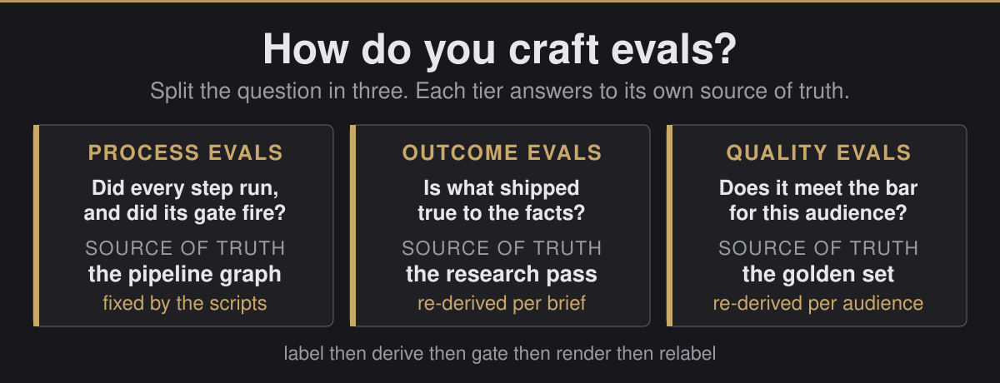
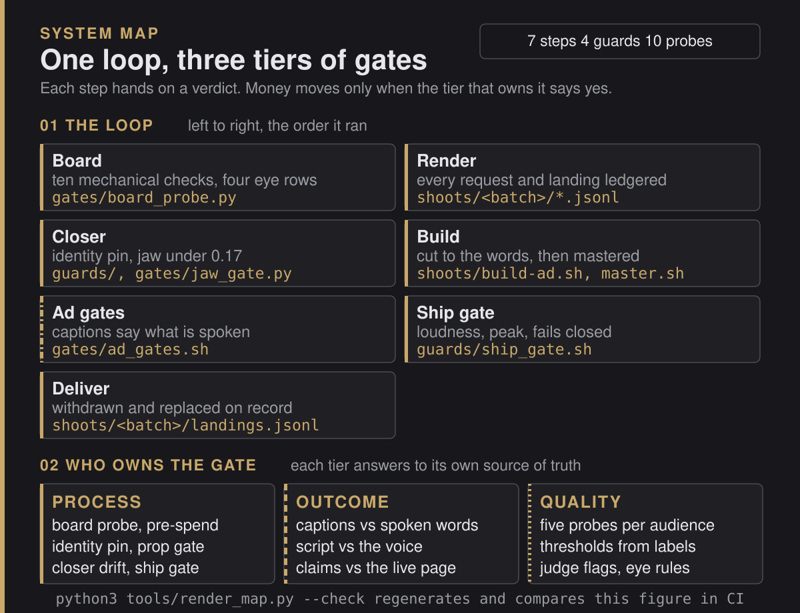
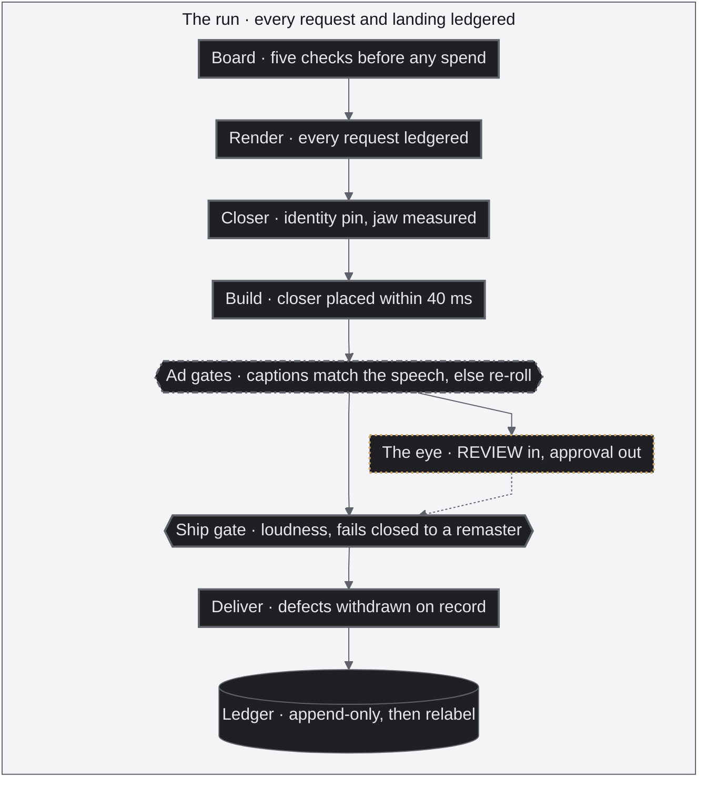

<p align="center">
  
</p>

<div align="center">

<b><font size="6">Autonomous Ads, Multimodal Router, Three-Tier Evals</font></b>

<br/>

<a href="https://github.com/jameswniu/autonomous-ads-pipeline-multimodal-evals/actions/workflows/checks.yml"></a>


<br/><br/>

<strong>I let it shoot ads with nobody watching, and it could not spend a dollar until its own checks passed.</strong><br/>
The evals grade pixels and audio instead of text, and they double as the router, picking the engine that wins each audience the way Perplexity picks a model per question.<br/>
This repository is that pipeline, released in full.

<br/>

<code>board -> render -> gate -> ship -> ledger</code>

</div>

---

## Run it on the pixels that ship

Two things are checkable here without accounts, keys or a GPU. `python3` and `ffmpeg` are the only prerequisites.

```
pip install -r requirements.txt

python3 evals/derive.py                    # re-derive every threshold
python3 probes/mirror_probe.py samples/exemplar-harbor-wan3-live.mp4
python3 probes/mirror_probe.py samples/frozen-control-slowroad.mp4
```

The derivation prints every named constant beside the labelled pass and labelled reject that bracket it, counts them at `10 of 10 NAMED gating thresholds are DERIVED`, and exits 0. The two probes print one line each:

```
MIRROR FORWARD: 16s | repeat 1.00 at P=5s (reject <0.4) | mirror 0.58 at t=10.4 (reject <0.22)
MIRROR UNJUDGEABLE: scene distance 0.7 < floor 5.0. NOT a pass - too static to measure.
```

**The second one exits 3, which is the right answer and not a broken run.** A frozen frame held for 40 s has no scene motion to measure, so the probe refuses to call it a pass. That clip is the labelled reject the derivation brackets `mirror_probe.CONTROL_FLOOR` with, and the live take from the previous command is the labelled pass on the same axis.

**`evals/derive.py` does not score a video.** It re-measures labelled exemplars and brackets the gating constants. The per-video path is a probe, or `gates/ad_gates.sh` for a full master, which needs the scene files and the caption manifest that live beside a master in a shoot directory and are not in this repository.

**How do you craft evals? Split the question in three, and give each part its own source of truth.**

| | The question it answers | Where its truth comes from | When it changes |
|:---|:---|:---|:---|
| **Process evals** | Did every step run, in order, and did its gate fire before money moved? | The pipeline's own graph | Only when the scripts change |
| **Outcome evals** | Is what shipped true, to the brief and to the facts it leans on? | The research pass behind the brief | Every time the brief changes |
| **Quality evals** | Does it meet the bar for the audience it was made for? | A golden set of hand-labelled exemplars, plus the market's own bar | Every time the audience changes |

Three words carry the page. A **probe** is a check, a **threshold** is the line that check has to clear, and a **gate** is what stops the job when the line is not cleared. A text eval reads a string. Every probe here is a measurement on the file itself, pixels, audio and timing, which is why the usual eval toolkit does not reach this work. Making the video was the easy half. The hard half is autonomy, deciding with nobody in the room whether it is good enough to pay for. The three tiers split that decision into pieces small enough to build.

- The first tier is the skeleton and it stays put.
- The other two are the parts you swap. Point the same loop at a new product and the outcome evals are re-derived from fresh research. Point it at a new audience and the quality evals are re-derived from a fresh golden set.
- The proof below comes from one autonomous ad production that ran end to end with nobody driving. Twenty-eight versions across five invented brands, then ten spec ads for real products, every render gated before a dollar moved.

<table>
  <tr>
    <td width="33%" align="center" valign="top"><a href="#1-process-evals"></a><br><b>Process.</b> Fifty-nine scene renders across four rounds sit in the ledger behind the eight cuts that shipped, and every gate fired before a dollar moved. <a href="#1-process-evals">See the ledger</a></td>
    <td width="33%" align="center" valign="top"><a href="#2-outcome-evals"></a><br><b>Outcome.</b> Four hundred pages fold into one. The line this spot closes on is the line on the company's own page, checked by a second engine told to refute it. <a href="#2-outcome-evals">See the spec ads</a></td>
    <td width="33%" align="center" valign="top"><a href="#3-quality-evals"></a><br><b>Quality.</b> Four engines shot the same coffee brief. A panel tuned to morning craving picked this one, and a panel tuned to sleep picked a different engine for a different brand. <a href="#3-quality-evals">See the race</a></td>
  </tr>
</table>

> The presenter is generated. She is not a real person and not a likeness of one, and her voice is a clone of a consented source. Every version of every spot is scored on this page or in its ledger, and the failures sit next to the winners.

---

## 1. Process evals

Process evals check how the work got made, before anyone looks at the result. The industry name is process supervision.

- Every step has a contract, the contract is checked the moment the step runs, and a failed check stops the job before the next dollar is spent.
- The source of truth is the pipeline graph, an orchestration framework such as LangGraph in most stacks and plain scripts here. This tier moves only when the scripts move.
- The exact scripts that ran are in this repository. Boards, batch drivers and ledgers in [`shoots/`](shoots/), the board probe, caption gate and closer checks in [`gates/`](gates/), the pixel probes in [`probes/`](probes/), the pre-spend guards in [`guards/`](guards/). The code map near the end says what each file is. Look generation stays out: it ran against the avatar vendor's account, with its own framing checks on the still, head and body inside the crop and shot size, and the closer path here starts from its output.

| Step | What it has to prove before the next step may start | How it fails |
|:---|:---|:---|
| Board | Five mechanical checks, free, before a cent is spent (the product absent before the payoff, the escalation declared, the quirk never spoken by the narration, mouths closed under narration, the centre-crop clause present), then four judgment rows I score 0 to 3 by eye | The board goes back |
| Render | Every request and every landing appended to the ledger, the vendor's own rejection text included | Recorded, re-rolled once with one variable moved |
| Closer | Identity pin on the voice and avatar ids, prop gate on the look, jaw measured on the raw render and refused over the band | Pre-spend |
| Build | The closer's video starts within 40 ms of where its audio was placed | Frame-exact, on the master |
| Ad gates | Every burned cue says what is spoken, within 0.5 s before or 0.3 s after its first word. The closer's mouth is not late | Blocks delivery |
| Ship gate | Loudness, true peak, silence tail, the standing disclosures. Exit 64 on unreadable input | Fails closed |
| Deliver | A defective delivered cut is withdrawn, replaced, and the withdrawal ledgered with its reason | On the record |

### The redo, as a ledger reads it

Four invented-brand spots were shot again after I kept rejecting boards. I review every cut by eye, and I am the only human in the loop.

- The grammar that survived is the one I named. Open absurd at three or four times the volume, hand over the coherent model by the second line, and keep every quirk visual with nobody narrating it.
- Each spot shipped two ways. One leg ran on the engine that won its panel in the four-engine race in section 3, the other on Omni Flash, from the same boards, narrations, closers, beds and captions. The only variable between the columns is the engine.
- The [ledgers](shoots/) hold four rounds behind them, 16, 16, 12 and 15 engine requests, 59 in all, two of them music beds, for eight shipped versions.
- Two of those rounds built four masters each and neither shipped.

<table>
  <tr>
    <td width="50%" align="center" valign="top"><br><b>Orchard Hill Coffee, Seedance 2.0, the WINNER.</b> <a href="https://github.com/jameswniu/autonomous-ads-pipeline-multimodal-evals/releases/download/media-2026-08/shoot-20260826-seedance2-orchard.mp4">&#9654; with sound</a></td>
    <td width="50%" align="center" valign="top"><br><b>Orchard Hill Coffee, Omni Flash.</b> <a href="https://github.com/jameswniu/autonomous-ads-pipeline-multimodal-evals/releases/download/media-2026-08/shoot-20260826-omni-orchard.mp4">&#9654; with sound</a></td>
  </tr>
</table>

| Process record, Orchard Hill Coffee | Seedance 2.0 | Omni Flash |
|:---|:---|:---|
| Scene renders in the ledger across the rounds, re-rolls included | 11 | 3 |
| Caption gate on the shipped master | PASS, 5 cues | PASS, 5 cues |
| Closer video against its audio placement | 0 ms | 0 ms |
| Mouth sync on the shared closer | PASS, +0.08 s | PASS, +0.08 s |
| Master that shipped | v3 | v1 |

<table>
  <tr>
    <td width="50%" align="center" valign="top"><div><a name="winner-lantern"></a></div><br><b>Lantern Street, Wan 3.0, the WINNER.</b> <a href="https://github.com/jameswniu/autonomous-ads-pipeline-multimodal-evals/releases/download/media-2026-08/shoot-20260826-wan3-lantern.mp4">&#9654; with sound</a></td>
    <td width="50%" align="center" valign="top"><br><b>Lantern Street, Omni Flash.</b> <a href="https://github.com/jameswniu/autonomous-ads-pipeline-multimodal-evals/releases/download/media-2026-08/shoot-20260826-omni-lantern.mp4">&#9654; with sound</a></td>
  </tr>
</table>

<table>
  <tr>
    <td width="50%" align="center" valign="top"><div><a name="winner-harbor"></a></div><br><b>Harbor Lane Realty, Wan 3.0, the WINNER.</b> <a href="https://github.com/jameswniu/autonomous-ads-pipeline-multimodal-evals/releases/download/media-2026-08/shoot-20260826-wan3-harbor.mp4">&#9654; with sound</a></td>
    <td width="50%" align="center" valign="top"><br><b>Harbor Lane Realty, Omni Flash.</b> <a href="https://github.com/jameswniu/autonomous-ads-pipeline-multimodal-evals/releases/download/media-2026-08/shoot-20260826-omni-harbor.mp4">&#9654; with sound</a></td>
  </tr>
</table>

<table>
  <tr>
    <td width="50%" align="center" valign="top"><div><a name="winner-slowroad"></a></div><br><b>Slow Road Travel, Seedance 2.0, the WINNER.</b> <a href="https://github.com/jameswniu/autonomous-ads-pipeline-multimodal-evals/releases/download/media-2026-08/shoot-20260826-seedance2-slowroad.mp4">&#9654; with sound</a></td>
    <td width="50%" align="center" valign="top"><br><b>Slow Road Travel, Omni Flash.</b> <a href="https://github.com/jameswniu/autonomous-ads-pipeline-multimodal-evals/releases/download/media-2026-08/shoot-20260826-omni-slowroad.mp4">&#9654; with sound</a></td>
  </tr>
</table>

| The other three spots | Renders in the ledger, winner's engine and Omni | Mouth sync on the shared closer | Masters that shipped |
|:---|:---|:---|:---|
| Lantern Street, Wan 3.0 | 8 and 3 | REVIEW, 0.00 s, eye approved | v7 and v1 |
| Harbor Lane Realty, Wan 3.0 | 12 and 5, the sign scene re-rolled for an invented phone number | PASS, 0.00 s | v5 and v2 |
| Slow Road Travel, Seedance 2.0 | 11 and 4 | REVIEW, +0.04 s, eye approved | v4 and v1 |

Every one of the eight masters passed the caption gate at five cues and held its closer at 0 ms drift. REVIEW means the mouth probe could not read the closer well enough to rule and handed the call to me, and the ledger says so. All eight cuts are in the [media release](https://github.com/jameswniu/autonomous-ads-pipeline-multimodal-evals/releases/tag/media-2026-08), with sound.

- Prompt-level constraints, written in the strongest form available, held on 6 of 15 attempts. A pre-call hook made the outcome right on 14 of 15, measured in [docs/ENFORCEMENT.md](docs/ENFORCEMENT.md). I now rank constraints by what happens when they are violated, and anything whose violation is silent gets a mechanism.
- The face-located mouth probe went in with its sign inverted and doubled the error it was built to remove. The gate caught it on the master. Three days later the same sign confusion came back in a different builder and reached the review thread, where a frame-by-frame audit found it rather than a probe. That auto-alignment is off now, and the check that replaced it is a frame ladder read by eye.
- Four guards protect the render path and three approve everything when a file they depend on goes missing. Two of the three do not know they are doing it, so a missing file looks exactly like a pass.

---

## 2. Outcome evals

Outcome evals check the artifact against the facts and do not care how it got made. The research literature calls this outcome supervision, and in retrieval terms it is a groundedness check.

- The claim on screen is compared with the source it was pulled from. How confident the model sounded does not count.
- In most stacks those facts arrive through retrieval, the RAG layer. Here they arrived through a pairwise research pass, one engine scanning the company's live pages and the other told to refute what it found.
- Either way the whole tier is re-derived when the brief changes.

For an ad, true means four things.

- The claim a spot closes on is the claim the company actually makes, in its own current words.
- The words on screen are the words being spoken, and the words being spoken are the script. The caption gate checks the first half. A transcription diffed against the script before any render is paid for checks the second.
- A prop that carries the story reads in the delivered crop.
- Hook rate, hold rate and view-through belong to the media buy, downstream of this pipeline. Everything measured on the creative before the buy is a proxy, and is labelled one.

### Ten real products, and nothing bends to the render

The invented brands were the easy case, because a story can bend to whatever the engine renders well. So the same loop ran against ten real, currently shipping AI products.

- All ten shot on Omni Flash at about sixty-three cents a scene, thirty scenes across two batches.
- Each master was gated on caption timing, closer alignment and lip sync before it was allowed out.
- These are spec ads. They are not affiliated with, endorsed by, or produced for Google, OpenAI, Perplexity, Meta, xAI, Z.ai, Moonshot AI or Anthropic. None of these companies has seen them, and every tagline is written here.

<table>
  <tr>
    <td width="50%" align="center" valign="top"><br><b>Claude.</b> Forty versions of you are arguing around the table and every one of them is sure. <a href="https://github.com/jameswniu/autonomous-ads-pipeline-multimodal-evals/releases/download/media-2026-08/shoot-20260830-claude.mp4">&#9654; with sound</a></td>
    <td width="50%" align="center" valign="top"><br><b>Claude Code.</b> His code grew legs overnight and finishes the feature while he sips the coffee. <a href="https://github.com/jameswniu/autonomous-ads-pipeline-multimodal-evals/releases/download/media-2026-08/shoot-20260830-claudecode.mp4">&#9654; with sound</a></td>
  </tr>
</table>

<table>
  <tr>
    <td width="50%" align="center" valign="top"><br><b>Google Pics.</b> The photo is almost right, and almost is the thing that ruins it. <a href="https://github.com/jameswniu/autonomous-ads-pipeline-multimodal-evals/releases/download/media-2026-08/shoot-20260827-pics.mp4">&#9654; with sound</a></td>
    <td width="50%" align="center" valign="top"><br><b>Gemini.</b> Your head has forty tabs open and not one of them is labelled. <a href="https://github.com/jameswniu/autonomous-ads-pipeline-multimodal-evals/releases/download/media-2026-08/shoot-20260827-gemini.mp4">&#9654; with sound</a></td>
  </tr>
</table>

<table>
  <tr>
    <td width="50%" align="center" valign="top"><br><b>Z.ai.</b> Her studio apartment is smaller than the problem she's solving. <a href="https://github.com/jameswniu/autonomous-ads-pipeline-multimodal-evals/releases/download/media-2026-08/shoot-20260830-zai.mp4">&#9654; with sound</a></td>
    <td width="50%" align="center" valign="top"><br><b>Kimi.</b> She has one question and a library's worth of everything else. <a href="https://github.com/jameswniu/autonomous-ads-pipeline-multimodal-evals/releases/download/media-2026-08/shoot-20260830-kimi.mp4">&#9654; with sound</a></td>
  </tr>
</table>

<table>
  <tr>
    <td width="50%" align="center" valign="top"><br><b>ChatGPT.</b> It is never the big decisions that eat the evening. <a href="https://github.com/jameswniu/autonomous-ads-pipeline-multimodal-evals/releases/download/media-2026-08/shoot-20260827-chatgpt.mp4">&#9654; with sound</a></td>
    <td width="50%" align="center" valign="top"><br><b>Perplexity.</b> Four hundred tabs, ten blue links, and still no answer. <a href="https://github.com/jameswniu/autonomous-ads-pipeline-multimodal-evals/releases/download/media-2026-08/shoot-20260827-perplexity.mp4">&#9654; with sound</a></td>
  </tr>
</table>

<table>
  <tr>
    <td width="50%" align="center" valign="top"><br><b>Meta AI.</b> Some days the list unrolls right out the front door. <a href="https://github.com/jameswniu/autonomous-ads-pipeline-multimodal-evals/releases/download/media-2026-08/shoot-20260827-metaai.mp4">&#9654; with sound</a></td>
    <td width="50%" align="center" valign="top"><br><b>Grok.</b> The whole street changes its mind three times before your coffee cools. <a href="https://github.com/jameswniu/autonomous-ads-pipeline-multimodal-evals/releases/download/media-2026-08/shoot-20260830-grok.mp4">&#9654; with sound</a></td>
  </tr>
</table>

| Spot | The claim it closes on | Checked against | |
|:---|:---|:---|:---|
| Claude | A thoughtful collaborator for serious work, until the answer is one page | claude.com and anthropic.com | [&#9654;](https://github.com/jameswniu/autonomous-ads-pipeline-multimodal-evals/releases/download/media-2026-08/shoot-20260830-claude.mp4) |
| Claude Code | The agent in your terminal that reads the codebase, fixes the bugs and ships the feature | The product page and its documentation | [&#9654;](https://github.com/jameswniu/autonomous-ads-pipeline-multimodal-evals/releases/download/media-2026-08/shoot-20260830-claudecode.mp4) |
| Google Pics | Image creation and editing that brings your exact vision to life, down to a single object | Google's own I/O 2026 announcement | [&#9654;](https://github.com/jameswniu/autonomous-ads-pipeline-multimodal-evals/releases/download/media-2026-08/shoot-20260827-pics.mp4) |
| Gemini | Google's personal assistant, hands free, across the apps you already use | gemini.google.com | [&#9654;](https://github.com/jameswniu/autonomous-ads-pipeline-multimodal-evals/releases/download/media-2026-08/shoot-20260827-gemini.mp4) |
| Z.ai | Frontier open models, the same weights the big labs guard, priced for builders | z.ai and its developer documentation | [&#9654;](https://github.com/jameswniu/autonomous-ads-pipeline-multimodal-evals/releases/download/media-2026-08/shoot-20260830-zai.mp4) |
| Kimi | A million pages read in a breath, answered with the one line that matters | moonshot.ai and kimi.com | [&#9654;](https://github.com/jameswniu/autonomous-ads-pipeline-multimodal-evals/releases/download/media-2026-08/shoot-20260830-kimi.mp4) |
| ChatGPT | Help with everyday questions and ideas | OpenAI's ChatGPT overview page | [&#9654;](https://github.com/jameswniu/autonomous-ads-pipeline-multimodal-evals/releases/download/media-2026-08/shoot-20260827-chatgpt.mp4) |
| Perplexity | An answer engine that hands back the answer with its sources attached | Perplexity's hub and help centre | [&#9654;](https://github.com/jameswniu/autonomous-ads-pipeline-multimodal-evals/releases/download/media-2026-08/shoot-20260827-perplexity.mp4) |
| Meta AI | A personal agent that works on your behalf | Meta's own page on personal agents | [&#9654;](https://github.com/jameswniu/autonomous-ads-pipeline-multimodal-evals/releases/download/media-2026-08/shoot-20260827-metaai.mp4) |
| Grok | Real-time answers with the sources still warm, from where news breaks first | x.ai and its developer documentation | [&#9654;](https://github.com/jameswniu/autonomous-ads-pipeline-multimodal-evals/releases/download/media-2026-08/shoot-20260830-grok.mp4) |

The first batch landed fifteen scenes on fifteen requests with zero content rejections. The second spent three re-rolls on art direction, none on defects.

- A For Sale sign that read perfectly in the raw 16:9 render shipped as OR SALE. The build cuts a centre square, and the engine had filled the width. Any scene whose beat is legible text is now composed small and dead centre, and checked in the square before the build. A probe flags a bright prop straddling a frame edge. It also fires on crowds and lamps, so it flags and I decide.
- A billboard of corrupted headline text was pulled for being illegible, replaced with clean colour fields, and then put back. The rule exists for fake logos and readable gibberish, and the glitch was the point. An outcome check has to know what the brief meant, and the rule alone cannot tell it.

---

## 3. Quality evals

Quality evals are the tier everyone argues about, so I made them the most mechanical of the three.

- A quality check, in practice, is a person watching a clip and saying good enough or not. I did that first, on the 48 labelled exemplars behind the thresholds and the 42 eye-labelled scenes behind the judge. Then the verdicts were compiled into numbers a scheduler can enforce.
- The source of truth is that golden set plus the market's own bar. The vendor's premium baseline sits in the race as the A0 column.
- Change the audience and the tier is re-derived, because what good means has flipped.
- One probe battery for everything. A category picks which rows gate and which merely report, and that pick is what defines the category. The direction of good is set per audience. A coffee ad reads gesture energy upward and a sleep ad flips the same instrument, because calm sells.
- 10 of the 10 named gating thresholds in [`probes/`](probes/) sit between a labelled pass and a labelled reject. A tool re-measures the shipped pixels and refuses to stay green if the number does not come back.
- I stay the final judge. A language-model judge attaches a blind description and a flag to the strip as evidence and never holds the verdict.

### The router, and the race behind it

Four engines ran the same five briefs with the audience written into every prompt, and the panels picked a different winner per audience. The winners table below is the router. A brief comes in, the panel for that audience scores the pool, and the highest row wins the buy.

- Bold is the best reading in its row, in that row's own direction.
- The WINNER takes the most rows. When versions tie, the row the panel gates on decides.
- One spot in full, then the other four.

<table>
  <tr>
    <td width="25%" align="center" valign="top"><br><b>A0 &middot; HeyGen, the baseline.</b> <a href="https://github.com/jameswniu/autonomous-ads-pipeline-multimodal-evals/releases/download/media-2026-08/shoot-20260824-a0-orchard.mp4">&#9654; with sound</a></td>
    <td width="25%" align="center" valign="top"><br><b>B1 &middot; Omni Flash.</b> <a href="https://github.com/jameswniu/autonomous-ads-pipeline-multimodal-evals/releases/download/media-2026-08/shoot-20260824-omni-orchard.mp4">&#9654; with sound</a></td>
    <td width="25%" align="center" valign="top"><br><b>B2 &middot; Wan 3.0.</b> <a href="https://github.com/jameswniu/autonomous-ads-pipeline-multimodal-evals/releases/download/media-2026-08/shoot-20260824-wan3-orchard.mp4">&#9654; with sound</a></td>
    <td width="25%" align="center" valign="top"><div><a name="winner-orchard"></a></div><br><b>B3 &middot; Seedance 2.0, the WINNER.</b> <a href="https://github.com/jameswniu/autonomous-ads-pipeline-multimodal-evals/releases/download/media-2026-08/shoot-20260824-seedance2-orchard.mp4">&#9654; with sound</a></td>
  </tr>
</table>

Orchard Hill Coffee sells morning energy and craving, so its panel gates gesture upward and lets the busy kitchen report.

| Probe | A0 HeyGen | B1 Omni Flash | B2 Wan 3.0 | **B3 Seedance 2.0, the WINNER** |
|---|---|---|---|---|
| Gesture energy, higher is better, gates | 0.468 | 0.609 | **0.787** | 0.664 |
| Background clutter, lower is better, bar 5.5 | 4.89 | **3.52** | 5.15 | 6.57 |
| Eye rejection, lower is better, reports | 9.86 | 8.68 | 12.79 | **7.69** |
| Scene simplicity, lower is calmer, reports | 7.37 | **6.7** | 8.10 | **6.7** |
| Face level wander, lower is steadier, reports | 148.9 | 150.6 | 150.3 | **114.5** |

Re-run on 2026-09-05 against the released Seedance master, face level 114.5, eye rejection 7.69 and background clutter 6.57 came back exactly, gesture 0.667 and scene 6.78 within probe scatter. Any row reproduces with `python3 probes/<probe>.py <master.mp4>`, and the redo's probe outputs ship in [`shoots/ads6-omni/probe-outputs/`](shoots/ads6-omni/probe-outputs/).

The same four engines shot Quiet Hours, a brief that sells permission to rest, and here the premium baseline swept the calm rows.

<table>
  <tr>
    <td width="25%" align="center" valign="top"><div><a name="winner-quiet"></a></div><br><b>A0 &middot; HeyGen, the WINNER.</b> <a href="https://github.com/jameswniu/autonomous-ads-pipeline-multimodal-evals/releases/download/media-2026-08/shoot-20260824-a0-quiet.mp4">&#9654; with sound</a></td>
    <td width="25%" align="center" valign="top"><br><b>B1 &middot; Omni Flash.</b> <a href="https://github.com/jameswniu/autonomous-ads-pipeline-multimodal-evals/releases/download/media-2026-08/shoot-20260824-omni-quiet.mp4">&#9654; with sound</a></td>
    <td width="25%" align="center" valign="top"><br><b>B2 &middot; Wan 3.0.</b> <a href="https://github.com/jameswniu/autonomous-ads-pipeline-multimodal-evals/releases/download/media-2026-08/shoot-20260824-wan3-quiet.mp4">&#9654; with sound</a></td>
    <td width="25%" align="center" valign="top"><br><b>B3 &middot; Seedance 2.0.</b> <a href="https://github.com/jameswniu/autonomous-ads-pipeline-multimodal-evals/releases/download/media-2026-08/shoot-20260824-seedance2-quiet.mp4">&#9654; with sound</a></td>
  </tr>
</table>

| Spot | The feeling it sells, and the row that gates | WINNER | Why |
|:---|:---|:---|:---|
| Orchard Hill Coffee | Morning craving, gesture energy upward | [Seedance 2.0](#winner-orchard) | Three rows: cleanest eye read, steadiest face, tie for calmest scene |
| Lantern Street | Three a.m. relief, clutter down | [Wan 3.0](#winner-lantern) | Three rows: calmest scene, steadiest face, the only system banner legible on the phone |
| Harbor Lane Realty | Neighborhood warmth, gesture upward | [Wan 3.0](#winner-harbor) | Three-way tie on rows, so the gated row decides: biggest wave, richest staging |
| Quiet Hours | Permission to rest, gesture flipped so calm wins | [HeyGen, the premium baseline](#winner-quiet) | Sweeps the four calm rows. This is where the router pays up |
| Slow Road Travel | Wanderlust, gesture upward | [Seedance 2.0](#winner-slowroad) | Three rows: cleanest eye read, calmest frame, steadiest face against Wan's bigger motion |

No engine sweeps the catalogue, which is the whole case for routing instead of standardising on a favourite.

- Wan 3.0 takes the spots that turn on legible story text and composed calm.
- Seedance 2.0 takes the ones that turn on clean eyes and a steady face.
- The sleep brand routes to the premium baseline.
- Omni Flash wins no panel here and keeps its seat anyway, for native ambient audio and the freest human motion.
- Scored again after the redo, the router's answer became Orchard to Omni Flash, Lantern to Wan 3.0, Harbor to Omni Flash and Slow Road to Seedance 2.0. Omni pays its way where a clean frame beats the biggest gesture.
- The race is fair by construction, because the three challengers sit in one price class. A four-deep pool per spot costs a few dollars, so a platform can serve each user the version that user responds to.
- All twenty versions are in the [media release](https://github.com/jameswniu/autonomous-ads-pipeline-multimodal-evals/releases/tag/media-2026-08).

| Version | Engine | What the Scenes Cost |
|---|---|---|
| A0 | HeyGen video agent, the baseline | 116 vendor credits for its sixteen scenes and seven closers, read off the balance |
| B1 | Omni Flash | About sixty cents a scene, nine dollars for its fifteen |
| B2 and B3 | Wan 3.0 and Seedance 2.0 | About thirty-two dollars together for their thirty scenes, roughly a dollar a scene |

- Ten scoring models were built and killed in one day, the record is in [docs/EVALS.md](docs/EVALS.md). Every one sat on a plausible axis and every one inverted on contact with the labelled set. A metric that agrees with the labels is not yet a metric either. One lip-sync reading matched 8 of 8 labels and was gating within minutes, until the same clip measured in thirds swung 6 to 10 frames against itself. A metric has to be stable inside one clip before I let it gate anything.
- The judge is a flagger. On a calibration set of 42 scenes I had labelled 16 FAIL and 26 PASS, and four versions of the judge are scored against it in [evals/judge-rubric.json](evals/judge-rubric.json). The first language-model pass caught 12 of the 16 failures while clearing only 12 of the 26 passes. Its flag goes on the strip as evidence and the verdict stays with me. And on the last night of the shoot every instrument favoured a swapped voice take and a nudged mouth, and I reverted both by ear. The meters nominate candidates and I pick.

All of this is in the prompt too. Every engine got the same brief with the audience written in, and the four columns under each spot are what four models did with identical words. A prompt is a request and a generation is a draw against it, and a prompt steers one engine but cannot tell you which engine to buy for this audience. So the loop holds both ends: the prompts know the user going in, the panel checks that the feeling landed coming out, and the next dollar routes on the count.

---

## Nobody directed the shoot

I set the rules and watched it run itself. I wrote no scripts for this shoot and supplied five things.

- the architecture and the framework
- the four-phase ad grammar, as a shape to follow
- a realism guard paragraph
- the rule that the most arresting beat opens the film
- the rule that every human on screen is the same presenter

- The agents ran the rest autonomously, loop-engineering boards, prompts, engine calls, quality gates, re-rolls, remasters and delivery, with every request and landing in an append-only ledger.
- The loop itself is the industry's own, hypothesis, variations, tests, winners, run by a multi-agent system instead of a team.
- The evals were designed and calibrated before a single render was paid for.

## The loop, as a map

One loop, seven steps, and it ran unattended. The gates are where the system stops itself, and that is the only reason it was allowed to spend.

<p align="center">
  
</p>

The figure is generated by `tools/render_map.py` from a declared step list. CI fails if the committed file drifts from the generator, or if the seven step names stop matching the process table above.

The same loop as a graph, top to bottom, with what the figure leaves out. Each step carries the line it must clear, from the process table above, and the two gates carry their fail path, re-roll when the ad gates block delivery and remaster when the ship gate fails closed. The eye, the only human in the loop, takes a REVIEW off the ad gates, and its approval sends the cut on to the ship gate. Deliver writes the ledger, and relabel means the next board's thresholds are re-derived from it. Who owns a gate is in the stroke, and the table under the graph reads it.




| Stroke | Tier | Owns |
|---|---|---|
| Solid | 1 Process | Board, Render, Closer, Build, Ship gate, Deliver |
| Dashed | 2 Outcome | Ad gates, shared with quality |
| Dotted | 3 Quality | The probes inside Ad gates, and the eye |
| Dash-dot | Shared | Ad gates, outcome and quality together |

## Code map

Everything below ran.

- Vendor ids and Slack fields are replaced with `<id>` or dropped.
- Home directories sit behind `$SHOOT_ROOT`, `$RENDERS`, `$GATES` and `$PORTRAIT`.
- The pinned voice and avatar are read from environment variables, so the closer path needs an identity of your own before it will render.

| Where | What it is |
|:---|:---|
| `shoots/ads2-redo/` | The race. Five briefs on three challenger engines, the baseline leg built beside them, 47 requests and 45 landings in the ledger |
| `shoots/ads3/`, `ads4/`, `ads5/` | The redo rounds on the race winners' engines. The first two built masters that never shipped, the third shipped after up to seven rebuilds |
| `shoots/ads6-omni/` | The Omni Flash leg of the redo from the boards that survived, with its panel scores and the raw probe outputs for all eight redo masters |
| `shoots/ads7-real/`, `ads8-real/` | The ten spec ads. Every board carries its positioning and the live page it was checked against |
| `shoots/<batch>/boards.json` | The brief per spot: audience, quirk, how the middle beat escalates, narration, closer, bed, and for the spec ads the verified positioning |
| `shoots/<batch>/build-*.sh` | The batch driver: normalise scenes, patch the assembly script, build every spot, master to the loudness standard |
| `shoots/build-ad.sh` | The assembly. Scenes trimmed to the narration's sentence boundaries from measured frame counts, captions written beside the master with each cue's spoken window, the closer placed frame-exact, one music bed per brand |
| `shoots/<batch>/requests.jsonl`, `landings.jsonl` | The append-only ledgers. Every engine request with its prompt, every landing with the vendor's own rejection text when there was one, every gated master with its caption, drift and mouth readings, every withdrawal with its reason |
| `gates/board_probe.py` | The five mechanical checks on a board before a cent is spent, and the four judgment rows printed for me to score |
| `gates/ad_gates.sh`, `caption_gate.py`, `mouth_sync_probe.py` | The caption gate and the closer gate a master must clear before delivery |
| `gates/edge_clip_probe.py`, `script_match.sh`, `voice_take.sh` | The frame-edge flagger for legible props, the transcription diff against the script, the three-draw voice meter |
| `gates/source_gate.py` | The closer look path: jaw, settle and loop jump measured on the raw render. The framing checks on the look, head and body inside the crop and shot size, run in look generation, which drives the avatar vendor's account and stays out of the repo |
| `probes/` | The ten instruments the panels and gates read: gesture energy, background detail, eye rejection, scene simplicity, face level wander, lip sync, sync lag, replay detection, and the rest and spasm meters the ship gate runs on closers |
| `guards/` | The four pre-spend guards and the learned rules the prop gate reads back |
| `evals/derive.py`, `evals/labels.csv` | The labelled exemplars and the tool that re-measures them and brackets every gating constant. It derives thresholds and does not score a video |
| `evals/judge-rubric.json`, `evals/judge-calibration.json` | The rubric the language-model judge scores against, and the 42 eye-labelled scenes its four versions were calibrated on |

## Recounted on every push

- 10 of the 10 named gating thresholds in [`probes/`](probes/) are bracketed by a labelled pass and a labelled reject.
- [`evals/derive.py`](evals/derive.py) re-measures the shipped pixels and refuses to exit clean if a constant has drifted outside its own bracket.
- Its report is checked in CI, so a hand-typed count cannot go stale on this page:

```
10 of 10 NAMED gating thresholds are DERIVED from a labelled pass/reject pair on the same axis
0 are AUTHORED: typed by hand, no exemplar pair in evals/labels
```

**Ten of ten.** The tool counts NAMED constants only. One probe still refuses clips on nine inline numbers that cannot be bracketed until they are named, and the page says so rather than rounding them away. You can check it without accounts, keys or a GPU, with `python3` and `ffmpeg` installed:

```
git clone https://github.com/jameswniu/autonomous-ads-pipeline-multimodal-evals
cd autonomous-ads-pipeline-multimodal-evals && pip install -r requirements.txt
python3 evals/derive.py
```

## Which checks stop a ship, and which only speak

A mixed read is the design, not a broken run. Most probes report and do not refuse.

| Check | On a bad reading |
|:---|:---|
| `caption_gate.py` | **Blocks.** A caption that does not say what is spoken, or drifts outside its window, fails the master |
| Closer assembly drift | **Blocks** past 40 ms between where the closer's video starts and where its audio was placed |
| `mouth_sync_probe.py` | **Blocks** only at FAIL, which is correlation under 0.10, the mouth unrelated to the audio. REVIEW passes with a logged line and the eye decides |
| `sync_probe.py` | **Speaks only.** Demoted on 2026-08-27 after controls with a known 0.4 s shift moved it 80 ms in the wrong direction |
| `source_gate.py` | **Speaks only.** Prints jaw travel, settle ratio and loop jump as three raw numbers with no verdict, so the metric and the line can be argued separately |
| `probes/` | **Speak only** to the panels and the gates that read them |

A probe says which of those it means in its exit code. `mirror_probe.py` exits 0 when it looked and found no replay, 1 when it found one, 3 when the clip is too static to be judged either way, and 64 when it cannot run at all, no clip named or the file unreadable.

## Why measurement rather than a learned model

Every threshold here is a hand-picked number over a measured signal, and no probe holds a trained model. That was a choice about iteration speed, not a claim that it is the better answer.

- **Taste moved weekly while this was being built.** A constant sitting between a labelled pass and a labelled reject can be moved in an afternoon and re-bracketed by `derive.py` in one command. A fitted model needs relabelling and a retrain to answer the same question.
- **The scale path runs the other way.** At enough traffic to segment by audience, per-demographic learned thresholds beat one hand-picked line, and the labelled exemplars in `evals/labels.csv` are already the training data for that.
- **The generative side does hold models.** They are vendor APIs called over the network, not weights in this repository.

## Where the claims stop

- Production on this page means the pipeline ran unattended and spent real money on renders under its own gates. It does not mean a media buy, and no delivery metric is claimed anywhere here.
- The golden set carries one labeller's judgement, mine, and it is internally consistent. A second labeller and an agreement score are the next calibration step.
- Only what ships here is claimed, the 48 labelled rows behind the thresholds and the 42 scenes behind the judge. The production battery was calibrated on a larger labelled history that stays private.
- Sample sizes are counts, never rates: 15 governed runs, 42 calibration scenes, 8 lip-sync labels.
- Every outcome number here is measured on the creative. Hook rate, hold rate and view-through are the buy's numbers and are not on this page.
- The spec ads are unaffiliated. None of the eight companies has seen them.
- Engine prices and product positioning are as of August 2026, when the shoots ran, and are not re-checked.
- The pinned identity stays in production. The voice id, avatar group and look ids are environment variables or `<id>` in the ledgers. The scripts read end to end, and rendering again needs an identity and vendor accounts of your own.

This repository is the public release of the autonomous pipeline as it ran: the probes, the guards, the labelled exemplars and the derivation. The identity, the wider labelled history and the vendor accounts stay with the production system. Apache-2.0.
