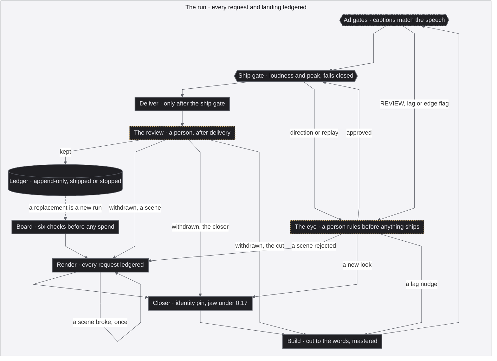

<p align="center">
  
</p>

<div align="center">

<b><font size="6">Autonomous Ads, Multimodal Router, Three-Tier Evals</font></b>

<br/>

<a href="https://github.com/jameswniu/autonomous-ads-pipeline-multimodal-evals/actions/workflows/checks.yml"></a>


<br/><br/>

<strong>I let it shoot ads with nobody watching, and it could not spend a dollar until its own checks passed.</strong><br/>
The evals grade pixels and audio instead of text, and they double as the router, picking the engine that wins each audience the way Perplexity picks a model per question.<br/>
This repository is that pipeline, released in full.

<br/>

<code>board -> render -> gate -> ship -> ledger</code>

</div>

---

## Three questions reviewers ask about this

**Is any of this mechanical, or did you type the numbers?** Mechanical, and the count is printed rather than claimed. `evals/derive.py` recomputes every named threshold from the labelled exemplars in `evals/labels.csv`, holds each one inside the interval its own labels imply, and prints what it could not derive. 10 of the 13 named gating thresholds in [`probes/`](probes/) and [`gates/`](gates/) are bracketed by a labelled pass and a labelled reject. Its report is checked in CI, so a count on this page cannot go stale:

```
10 of 13 NAMED gating thresholds are DERIVED from a labelled pass/reject pair on the same axis
3 are AUTHORED: typed by hand, no exemplar pair in evals/labels.csv
```

**Ten of thirteen.** The other three were typed by hand. One is the correlation floor inside the lip-sync gate that actually blocks a master, which has passes on one side and no reject on the other. Another is the closer's jaw ceiling, 0.17, the latest dated ruling, with no labelled pair behind it yet. The third is the cast gate's face similarity floor, 0.30, set halfway across a measured gap between strangers and the presenter's own takes. All three stay authored and say so. The loudness numbers the ship gate reads are a delivery spec rather than a judgement, so derive.py lists them apart and counts them in neither.

**Why probes and not ordinary tests?** A deterministic function has one right answer and gets a unit test. A generated video does not, since the same prompt returns different pixels every run, so the check is a measured property against a calibrated line, which is a probe. A judgement no measurement captures, whether an ad is worth watching, is an eval with human grades behind it. `docs/EVALS.md` classifies every file in `probes/` and `gates/` as one of those three or as a runner, and a test fails when a file is added and nobody says which.

**How does it stay correct over time?** Two checks on every push, wired together.

```
python3 evals/certify.py     # can each probe still measure a known shift?
python3 evals/derive.py      # does every threshold still sit inside its labels?
```

The certificate shifts a reference clip's audio by known amounts, reads what each probe reports, and fits the readings against the doses. Slope says whether a 100 ms shift still reads as 100 ms, sigma says how tightly, and the sign is checked because the two lip-sync probes use opposite conventions and a silent inversion once shipped a desync.

```
lipsync_probe    TRACKS slope +1.00 (sign +1 expected)  sigma 1.0 ms  n=9
sync_probe       TRACKS slope -1.00 (sign -1 expected)  sigma 0.0 ms  n=9
```

The deriver then caught something real. Pointed at `gates/mouth_sync_probe.py`, the check that actually blocks a master, it found the PASS bar sitting above eight masters that shipped with my approval:

```
mouth_sync_probe.PASS_CORR = 0.25 refuses 8 labelled pass(es) (floor, worst 0.14)
```

That is reported as refuted by its own labels rather than nudged to agree. A certificate is a claim about one version of the probe and one version of the certifier, so both hashes are recomputed before any threshold leans on it. And the margin it grants reaches no threshold today, for reasons the tool prints by name: the reference clip has no face, eleven thresholds measure something other than time, and the one certified time probe returns every dose exactly. That gap is on the page because the tool refuses to hide it.

## Where a label comes from, and how a wrong one gets caught

A threshold is only as good as the grades behind it, so the first question is what a grade actually is here. It is a person watching a clip and saying good enough or not, written down before any metric existed. I did that on the 78 labelled exemplars behind the thresholds and the 42 eye-labelled scenes behind the judge. The exemplars live in `evals/labels.csv`, and they are not all worth the same, so the file says which kind each one is and the tool checks each kind differently.

Seven ship their pixels. The frame is in the repository, and `derive.py` re-measures it with the probe's own function on every run. A stranger can check those without asking me anything.

Thirty are withheld but attested. The render is too big to ship, but the gate that measured it wrote its verdict into a shipping ledger the day that master went out, and the ledger is committed. The number and the verdict are re-read from it every run, keyed by shoot and master together. Cite the wrong shoot, leave a master with two gated records, or drop the citation and the build fails.

Forty-one are attested from the derivation notes alone, and those source renders are gone. That is the weakest tier and it is counted separately rather than folded in.

**How a wrong label surfaces.** Not by inspection. A label and a threshold are two claims about the same boundary, so the deriver reports when they disagree and makes somebody choose which one is wrong. That is not hypothetical here:

```
mouth_sync_probe.PASS_CORR = 0.25 refuses 8 labelled pass(es) (floor, worst 0.14)
```

Eight masters shipped with my approval sit below a bar that calls them failures. Either the bar is wrong or eight grades are, and the tool refuses to guess. It is reported as refuted by its own labels rather than quietly nudged to agree. A label whose probe and axis match no gate at all is a hard failure too, because a typo that looks like evidence is worse than a missing row. Labels are append only from a named commit, so a row cannot be rewritten later to make a threshold pass.

## Why a language model flags and never decides

The judge was built, measured against grades I had already made, and lost. Forty-two scenes, labelled by eye as sixteen fail and twenty-six pass before any model saw them. Three prompt shapes were scored against the whole set, and all of them are recorded in [`evals/judge-rubric.json`](evals/judge-rubric.json):

| Version | Caught, of 16 eye-fails | Cleared, of 26 eye-passes |
|---|---|---|
| One strip, brief in the prompt | 12 | 12 |
| Three panels, the eye standard in the prompt | 2 | 24 |
| Blind describe, then judge | 11 | 10 |

A fourth ran on a stronger model against eight decisive clips rather than the full set, so it is kept out of the table rather than shown against denominators it never faced. It is in the rubric with the other three.

The second version is the one worth sitting with. Handing the model my own standard made it agree with me about what passes and blind to almost everything that fails, which is the shape of a judge that has learned the answer rather than the task. Disagreement never fell below about four in ten however it was prompted.

The failure is specific, not vague. It misses object and subject substitutions, a phone for a ring box, a tablet for an umbrella, a young woman for a grandmother, and it false-alarms on gestalt calls the eye accepts. That fourth version caught all 5 fails in its 8 clips and cleared 0 of the 3 passes, and it never once caught a fail for the reason the eye had.

One confound turned up and is recorded rather than buried. The eye had labelled the trimmed window the cut actually used while the judge was shown the whole five seconds, so part of the disagreement was the two of them looking at different footage. The pipeline now judges the used window only.

So the judge attaches a blind description and a flag to the strip as evidence, and the verdict stays with a person. Each eye row records whether it agreed with the flag, so the disagreement rate is reported next to what the leg cost. On the last night of the shoot every instrument favoured a swapped voice take and a nudged mouth, and I reverted both by ear.

## Reproduce it

Nothing here needs an account, a key or a GPU. `python3` and `ffmpeg` are the prerequisites.

```
git clone https://github.com/jameswniu/autonomous-ads-pipeline-multimodal-evals
cd autonomous-ads-pipeline-multimodal-evals
make check
```

That installs what CI installs and runs what CI runs: lint, the derivation, the certificate, the figure byte-checks and the test suite. Green here means what green means on the Actions tab. Two probes run on pixels that ship in `samples/`:

```
python3 probes/mirror_probe.py samples/exemplar-harbor-wan3-live.mp4
python3 probes/mirror_probe.py samples/frozen-control-slowroad.mp4
```

The first prints a forward read and exits 0. The second exits 3, on purpose: a frame held for 40 seconds has no motion to judge, so the probe refuses to call it a pass. That clip is the labelled reject behind `mirror_probe.CONTROL_FLOOR`, and the live take is the labelled pass on the same axis. `CLAUDE.md` has the rest of the commands for an agent opening the repository cold.

**How do you craft evals? Split the question in three, and give each part its own source of truth.**

| | The question it answers | Where its truth comes from | When it changes |
|:---|:---|:---|:---|
| **Process evals** | Did every step run, in order, and did its gate fire before money moved? | The pipeline's own graph | Only when the scripts change |
| **Outcome evals** | Is what shipped true, to the brief and to the facts it leans on? | The research pass behind the brief | Every time the brief changes |
| **Quality evals** | Does it meet the bar for the audience it was made for? | A golden set of hand-labelled exemplars, plus the market's own bar | Every time the audience changes |

A probe is a check, a threshold is the line it has to clear, and a gate is what stops the job when it is not cleared. Every probe here measures the file itself, pixels, audio and timing, which is why the usual text-eval toolkit does not reach this work. The first tier is the skeleton and stays put. The other two are re-derived, from fresh research when the product changes and from a fresh golden set when the audience does.

<table>
  <tr>
    <td width="33%" align="center" valign="top"><a href="docs/TIERS.md#1-process-evals"></a><br><b>Process.</b> Fifty-nine scene renders across four rounds sit in the ledger behind the eight cuts that shipped, and every gate fired before a dollar moved. <a href="docs/TIERS.md#1-process-evals">See the ledger</a></td>
    <td width="33%" align="center" valign="top"><a href="docs/TIERS.md#2-outcome-evals"></a><br><b>Outcome.</b> Four hundred pages fold into one. The line this spot closes on is the line on the company's own page, checked by a second engine told to refute it. <a href="docs/TIERS.md#2-outcome-evals">See the spec ads</a></td>
    <td width="33%" align="center" valign="top"><a href="docs/TIERS.md#3-quality-evals"></a><br><b>Quality.</b> Four engines shot the same coffee brief. A panel tuned to morning craving picked this one, and a panel tuned to sleep picked a different engine for a different brand. <a href="docs/TIERS.md#3-quality-evals">See the race</a></td>
  </tr>
</table>

> The presenter is generated. She is not a real person and not a likeness of one, and her voice is a clone of a consented source. Every version of every spot is scored on this page or in its ledger, and the failures sit next to the winners.

---

## The shoot, tier by tier

The three tiers were exercised on one autonomous production, and the full record sits in [`docs/TIERS.md`](docs/TIERS.md): the process ledger per spot, the outcome checks against each company's own page, and the quality race where four engines shot the same brief and a different one won each audience. Every number there is read back from its ledger by a test.

## An agent ran the shoot, and the graph is what it became

I set the rules and an agent ran the shoot from them. I supplied the architecture, the four-phase ad grammar, a realism guard paragraph, the rule that the most arresting beat opens the film, and the rule that every human on screen is the same presenter. The agent did the rest, the boards, prompts, engine calls, gates, re-rolls, remasters and delivery, and I reviewed every cut it delivered. The evals were calibrated before a single render was paid for. Once the runs converged, the loop was compiled into the LangGraph below, and [`docs/PIPELINE.md`](docs/PIPELINE.md) says what changed, what the August ledgers show when replayed against it, and which part is mine.

## The loop, as a map

One loop, seven steps. The gates are where the system stops itself, and that is the only reason it was allowed to spend.

<p align="center">
  
</p>

The figure is generated by `tools/render_map.py` from `pipeline/steps.py`, the same step list the graph is built from. CI fails if the committed file drifts from the generator.

The same loop as the graph that runs it, [`pipeline/graph.py`](pipeline/graph.py), top to bottom. Every edge below is an edge the compiler holds, and a test fails if the two disagree in either direction. A person decides at two points, both LangGraph interrupts that record who answered. The eye rules before anything ships on what a gate cannot, a mouth REVIEW, a lag worth a nudge, a prop cut off at the frame edge, or footage that may run backwards or replay itself. Every scene that shows the presenter is rendered from her face, and a cast gate reads every scene back against that face whenever the run has it, refusing anyone on screen who is not her. The review comes after delivery, because delivery is reversible and that is where the August ledgers show I looked, and a withdrawal goes back to the step that fixes it. A master that clears every gate ships without anyone looking first, and the review is where a person does. Every loop has a ceiling, after which the run stops. Any stop closes the run in the ledger, which the figure leaves out to stay readable. The dotted line is a replacement cut, which in August meant a new run from the board.




| Stroke | Tier | Owns |
|---|---|---|
| Solid | 1 Process | Board, Render, Closer, Build, Ship gate, Deliver |
| Dashed | 2 Outcome | Ad gates, shared with quality |
| Dotted | 3 Quality | The probes inside Ad gates, the eye and the review |
| Dash-dot | Shared | Ad gates, outcome and quality together |

## The race behind the router

Four engines ran the same five briefs with the audience written into every prompt, and the panels picked a different winner per audience. The winners table below is the router. A brief comes in, the panel for that audience scores the pool, and the highest row wins the buy.

- Bold is the best reading in its row, in that row's own direction.
- The WINNER takes the most rows. When versions tie, the row the panel gates on decides.
- One spot in full, then the other four.

<table>
  <tr>
    <td width="25%" align="center" valign="top"><br><b>A0 &middot; HeyGen, the baseline.</b> <a href="https://github.com/jameswniu/autonomous-ads-pipeline-multimodal-evals/releases/download/media-2026-08/shoot-20260824-a0-orchard.mp4">&#9654; with sound</a></td>
    <td width="25%" align="center" valign="top"><br><b>B1 &middot; Omni Flash.</b> <a href="https://github.com/jameswniu/autonomous-ads-pipeline-multimodal-evals/releases/download/media-2026-08/shoot-20260824-omni-orchard.mp4">&#9654; with sound</a></td>
    <td width="25%" align="center" valign="top"><br><b>B2 &middot; Wan 3.0.</b> <a href="https://github.com/jameswniu/autonomous-ads-pipeline-multimodal-evals/releases/download/media-2026-08/shoot-20260824-wan3-orchard.mp4">&#9654; with sound</a></td>
    <td width="25%" align="center" valign="top"><div><a name="winner-orchard"></a></div><br><b>B3 &middot; Seedance 2.0, the WINNER.</b> <a href="https://github.com/jameswniu/autonomous-ads-pipeline-multimodal-evals/releases/download/media-2026-08/shoot-20260824-seedance2-orchard.mp4">&#9654; with sound</a></td>
  </tr>
</table>

Orchard Hill Coffee sells morning energy and craving, so its panel gates gesture upward and lets the busy kitchen report.

| Probe | A0 HeyGen | B1 Omni Flash | B2 Wan 3.0 | **B3 Seedance 2.0, the WINNER** |
|---|---|---|---|---|
| Gesture energy, higher is better, gates | 0.468 | 0.609 | **0.787** | 0.664 |
| Background clutter, lower is better, bar 5.5 | 4.89 | **3.52** | 5.15 | 6.57 |
| Eye rejection, lower is better, reports | 9.86 | 8.68 | 12.79 | **7.69** |
| Scene simplicity, lower is calmer, reports | 7.37 | **6.7** | 8.10 | **6.7** |
| Face level wander, lower is steadier, reports | 148.9 | 150.6 | 150.3 | **114.5** |

Re-run on 2026-09-05 against the released Seedance master, face level 114.5, eye rejection 7.69 and background clutter 6.57 came back exactly, gesture 0.667 and scene 6.78 within probe scatter. Any row reproduces with `python3 probes/<probe>.py <master.mp4>`, and the redo's probe outputs ship in [`shoots/ads6-omni/probe-outputs/`](shoots/ads6-omni/probe-outputs/).

The same four engines shot Quiet Hours, a brief that sells permission to rest, and here the premium baseline swept the calm rows.

<table>
  <tr>
    <td width="25%" align="center" valign="top"><div><a name="winner-quiet"></a></div><br><b>A0 &middot; HeyGen, the WINNER.</b> <a href="https://github.com/jameswniu/autonomous-ads-pipeline-multimodal-evals/releases/download/media-2026-08/shoot-20260824-a0-quiet.mp4">&#9654; with sound</a></td>
    <td width="25%" align="center" valign="top"><br><b>B1 &middot; Omni Flash.</b> <a href="https://github.com/jameswniu/autonomous-ads-pipeline-multimodal-evals/releases/download/media-2026-08/shoot-20260824-omni-quiet.mp4">&#9654; with sound</a></td>
    <td width="25%" align="center" valign="top"><br><b>B2 &middot; Wan 3.0.</b> <a href="https://github.com/jameswniu/autonomous-ads-pipeline-multimodal-evals/releases/download/media-2026-08/shoot-20260824-wan3-quiet.mp4">&#9654; with sound</a></td>
    <td width="25%" align="center" valign="top"><br><b>B3 &middot; Seedance 2.0.</b> <a href="https://github.com/jameswniu/autonomous-ads-pipeline-multimodal-evals/releases/download/media-2026-08/shoot-20260824-seedance2-quiet.mp4">&#9654; with sound</a></td>
  </tr>
</table>

| Spot | The feeling it sells, and the row that gates | WINNER | Why |
|:---|:---|:---|:---|
| Orchard Hill Coffee | Morning craving, gesture energy upward | [Seedance 2.0](#winner-orchard) | Three rows: cleanest eye read, steadiest face, tie for calmest scene |
| Lantern Street | Three a.m. relief, clutter down | [Wan 3.0](#winner-lantern) | Three rows: calmest scene, steadiest face, the only system banner legible on the phone |
| Harbor Lane Realty | Neighborhood warmth, gesture upward | [Wan 3.0](#winner-harbor) | Three-way tie on rows, so the gated row decides: biggest wave, richest staging |
| Quiet Hours | Permission to rest, gesture flipped so calm wins | [HeyGen, the premium baseline](#winner-quiet) | Sweeps the four calm rows. This is where the router pays up |
| Slow Road Travel | Wanderlust, gesture upward | [Seedance 2.0](#winner-slowroad) | Three rows: cleanest eye read, calmest frame, steadiest face against Wan's bigger motion |

Orchard is the one race in this table with every probe value on the ledger, and its winner reproduces from the numbers. The other four winners are hand calls made at the time, held in `races/races.jsonl` as `recorded_winner` with no probe scores recorded behind them, so their Why column is the reasoning that was written down and not a score anyone can re-run.

No engine sweeps the catalogue, which is the whole case for routing instead of standardising on a favourite.

- Wan 3.0 takes the spots that turn on legible story text and composed calm.
- Seedance 2.0 takes the ones that turn on clean eyes and a steady face.
- The sleep brand routes to the premium baseline.
- Omni Flash wins no panel here and keeps its seat anyway, for native ambient audio and the freest human motion.
- Scored again after the redo, the router's answer became Orchard to Omni Flash, Lantern to Wan 3.0, Harbor to Omni Flash and Slow Road to Seedance 2.0. Omni pays its way where a clean frame beats the biggest gesture.
- The race is fair by construction, because the three challengers sit in one price class. A four-deep pool per spot costs a few dollars, so a platform can serve each user the version that user responds to.
- All twenty versions are in the [media release](https://github.com/jameswniu/autonomous-ads-pipeline-multimodal-evals/releases/tag/media-2026-08).

| Version | Engine | What the Scenes Cost |
|---|---|---|
| A0 | HeyGen video agent, the baseline | 116 vendor credits for its sixteen scenes and seven closers, read off the balance |
| B1 | Omni Flash | About sixty cents a scene, nine dollars for its fifteen |
| B2 and B3 | Wan 3.0 and Seedance 2.0 | About thirty-two dollars together for their thirty scenes, roughly a dollar a scene |

- Ten scoring models were built and killed in one day, the record is in [docs/EVALS.md](docs/EVALS.md). Every one sat on a plausible axis and every one inverted on contact with the labelled set. A metric that agrees with the labels is not yet a metric either. One lip-sync reading matched 8 of 8 labels and was gating within minutes, until the same clip measured in thirds swung 6 to 10 frames against itself. A metric has to be stable inside one clip before I let it gate anything.
- The judge is a flagger. On a calibration set of 42 scenes I had labelled 16 FAIL and 26 PASS, and four versions of the judge are scored against it in [evals/judge-rubric.json](evals/judge-rubric.json). The first language-model pass caught 12 of the 16 failures while clearing only 12 of the 26 passes. Its flag goes on the strip as evidence and the verdict stays with me. And on the last night of the shoot every instrument favoured a swapped voice take and a nudged mouth, and I reverted both by ear. The meters nominate candidates and I pick.

All of this is in the prompt too. Every engine got the same brief with the audience written in, and the four columns under each spot are what four models did with identical words. A prompt is a request and a generation is a draw against it, and a prompt steers one engine but cannot tell you which engine to buy for this audience. So the loop holds both ends: the prompts know the user going in, the panel checks that the feeling landed coming out, and the next dollar routes on the count.

The other three winners, each redone on the engine that won it. Every one of these is a spot the pipeline shipped after its own gates passed.

<table>
  <tr>
    <td width="50%" align="center" valign="top"><div><a name="winner-lantern"></a></div><br><b>Lantern Street, Wan 3.0, the WINNER.</b> <a href="https://github.com/jameswniu/autonomous-ads-pipeline-multimodal-evals/releases/download/media-2026-08/shoot-20260826-wan3-lantern.mp4">&#9654; with sound</a></td>
    <td width="50%" align="center" valign="top"><br><b>Lantern Street, Omni Flash.</b> <a href="https://github.com/jameswniu/autonomous-ads-pipeline-multimodal-evals/releases/download/media-2026-08/shoot-20260826-omni-lantern.mp4">&#9654; with sound</a></td>
  </tr>
</table>

<table>
  <tr>
    <td width="50%" align="center" valign="top"><div><a name="winner-harbor"></a></div><br><b>Harbor Lane Realty, Wan 3.0, the WINNER.</b> <a href="https://github.com/jameswniu/autonomous-ads-pipeline-multimodal-evals/releases/download/media-2026-08/shoot-20260826-wan3-harbor.mp4">&#9654; with sound</a></td>
    <td width="50%" align="center" valign="top"><br><b>Harbor Lane Realty, Omni Flash.</b> <a href="https://github.com/jameswniu/autonomous-ads-pipeline-multimodal-evals/releases/download/media-2026-08/shoot-20260826-omni-harbor.mp4">&#9654; with sound</a></td>
  </tr>
</table>

<table>
  <tr>
    <td width="50%" align="center" valign="top"><div><a name="winner-slowroad"></a></div><br><b>Slow Road Travel, Seedance 2.0, the WINNER.</b> <a href="https://github.com/jameswniu/autonomous-ads-pipeline-multimodal-evals/releases/download/media-2026-08/shoot-20260826-seedance2-slowroad.mp4">&#9654; with sound</a></td>
    <td width="50%" align="center" valign="top"><br><b>Slow Road Travel, Omni Flash.</b> <a href="https://github.com/jameswniu/autonomous-ads-pipeline-multimodal-evals/releases/download/media-2026-08/shoot-20260826-omni-slowroad.mp4">&#9654; with sound</a></td>
  </tr>
</table>

## Code map

Everything below ran.

- Vendor ids and Slack fields are replaced with `<id>` or dropped.
- Home paths sit behind `$SHOOT_ROOT`, `$RENDERS`, `$GATES` and `$FACEPY`.
- The pinned voice and avatar are read from environment variables, so the closer path needs an identity of your own before it will render.

| Where | What it is |
|:---|:---|
| `shoots/ads2-redo/` | The race. Five briefs on three challenger engines, the baseline leg built beside them, 47 requests and 45 landings in the ledger |
| `shoots/ads3/`, `ads4/`, `ads5/` | The redo rounds on the race winners' engines. The first two rounds' cuts were delivered and then withdrawn, and the third's stood after up to seven rebuilds |
| `shoots/ads6-omni/` | The Omni Flash leg of the redo from the boards that survived, with its panel scores and the raw probe outputs for all eight redo masters |
| `shoots/ads7-real/`, `ads8-real/` | The ten spec ads. Every board carries its positioning and the live page it was checked against |
| `shoots/<batch>/boards.json` | The brief per spot: audience, quirk, how the middle beat escalates, narration, closer, bed, and for the spec ads the verified positioning |
| `shoots/<batch>/build-*.sh` | The batch driver: normalise scenes, patch the assembly script, build every spot, master to the loudness standard |
| `shoots/build-ad.sh` | The assembly. Scenes trimmed to the narration's sentence boundaries from measured frame counts, captions written beside the master with each cue's spoken window, the closer placed frame-exact, one music bed per brand |
| `shoots/<batch>/requests.jsonl`, `landings.jsonl` | The append-only ledgers. Every engine request with its prompt, every landing with the vendor's own rejection text when there was one, every gated master with its caption, drift and mouth readings, every withdrawal with its reason |
| `gates/board_probe.py` | The six mechanical checks on a board before a cent is spent, and the four judgment rows printed for me to score |
| `gates/ad_gates.sh`, `caption_gate.py`, `mouth_sync_probe.py` | The caption gate and the closer gate a master must clear before delivery |
| `gates/edge_clip_probe.py`, `script_match.sh`, `voice_take.sh` | The frame-edge flagger for legible props, the transcription diff against the script, the three-draw voice meter whose consensus probe lives outside this repo and which now refuses to spend a draw without it |
| `gates/source_gate.py` | The closer look path: jaw, settle and loop jump measured on the raw render. The framing checks on the look, head and body inside the crop and shot size, run in look generation, which drives the avatar vendor's account and stays out of the repo |
| `probes/` | The ten instruments the panels and gates read: gesture energy, background detail, eye rejection, scene simplicity, face level wander, lip sync, sync lag, replay detection, and the rest and spasm meters the ship gate runs on closers |
| `guards/` | The four pre-spend guards and the learned rules the prop gate reads back |
| `evals/derive.py`, `evals/labels.csv` | The labelled exemplars and the tool that re-measures them and brackets every gating constant. It derives thresholds and does not score a video |
| `evals/judge-rubric.json`, `evals/judge-calibration.json` | The rubric the language-model judge scores against, and the 42 eye-labelled scenes its four versions were calibrated on |

## Which checks stop a ship, and which only speak

A mixed read is the design, not a broken run. Most probes report and do not refuse.

| Check | On a bad reading |
|:---|:---|
| `caption_gate.py` | **Blocks.** A caption that does not say what is spoken, or drifts outside its window, fails the master |
| Closer assembly drift | **Blocks** past 40 ms between where the closer's video starts and where its audio was placed |
| `mouth_sync_probe.py` | **Blocks** only at FAIL, which is correlation under 0.10, the mouth unrelated to the audio. REVIEW passes with a logged line and the eye decides |
| `cast_gate.py` | **Blocks** a scene whose person is not the presenter, under 0.30 face similarity to her reference. It is sent once more, and a second miss stops the run. No face, or no reading, goes to the eye |
| `sync_probe.py` | **Speaks only.** Demoted on 2026-08-27 after controls with a known 0.4 s shift moved it 80 ms in the wrong direction |
| `source_gate.py` | **Speaks only.** Prints jaw travel, settle ratio and loop jump as three raw numbers with no verdict, so the metric and the line can be argued separately |
| `probes/` | **Speak only** to the panels and the gates that read them |

A probe says which of those it means in its exit code. `mirror_probe.py` exits 0 when it looked and found no replay, 1 when it found one, 3 when the clip is too static to be judged either way, and 64 when it cannot run at all, no clip named or the file unreadable.

## Why measurement rather than a learned model

Every threshold here is a hand-picked number over a measured signal, and no probe holds a trained model. That was a choice about iteration speed, not a claim that it is the better answer.

Taste moved weekly while this was being built. A constant sitting between a labelled pass and a labelled reject can be moved in an afternoon and re-bracketed by `derive.py` in one command, where a fitted model needs relabelling and a retrain to answer the same question.

At scale the argument runs the other way. With enough traffic to segment by audience, per-demographic learned thresholds beat one hand-picked line, and the labelled rows in `evals/labels.csv` are already the training data for that.

The generative side does hold models. They are vendor APIs called over the network rather than weights in this repository.

## Where the claims stop

- Production on this page means the pipeline ran unattended and spent real money on renders under its own gates. It does not mean a media buy, and no delivery metric is claimed anywhere here.
- The golden set carries one labeller's judgement, mine, and it is internally consistent. A second labeller and an agreement score are the next calibration step.
- Only what ships here is claimed, the 78 labelled rows behind the thresholds and the 42 scenes behind the judge. The production battery was calibrated on a larger labelled history that stays private.
- Sample sizes are counts, never rates: 15 governed runs, 42 calibration scenes, 36 lip-sync labels.
- Every outcome number here is measured on the creative. Hook rate, hold rate and view-through are the buy's numbers and are not on this page.
- The spec ads are unaffiliated. None of the eight companies has seen them.
- Engine prices and product positioning are as of August 2026, when the shoots ran, and are not re-checked.
- The pinned identity stays in production. The voice id, avatar group and look ids are environment variables or `<id>` in the ledgers. The scripts read end to end, and rendering again needs an identity and vendor accounts of your own.

This repository is the public release of the autonomous pipeline as it ran: the probes, the guards, the labelled exemplars and the derivation. The identity, the wider labelled history and the vendor accounts stay with the production system. Apache-2.0.
