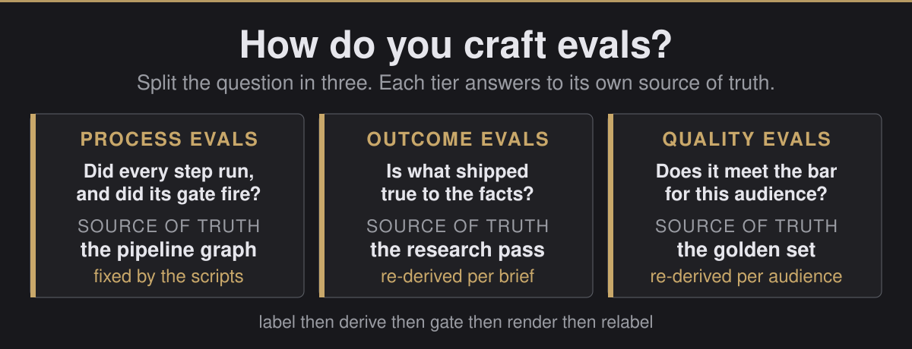
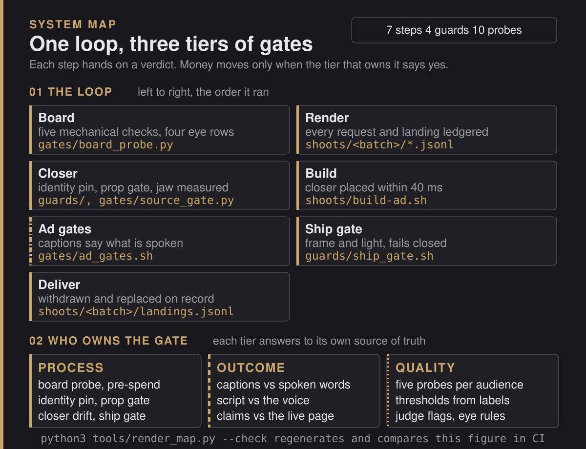
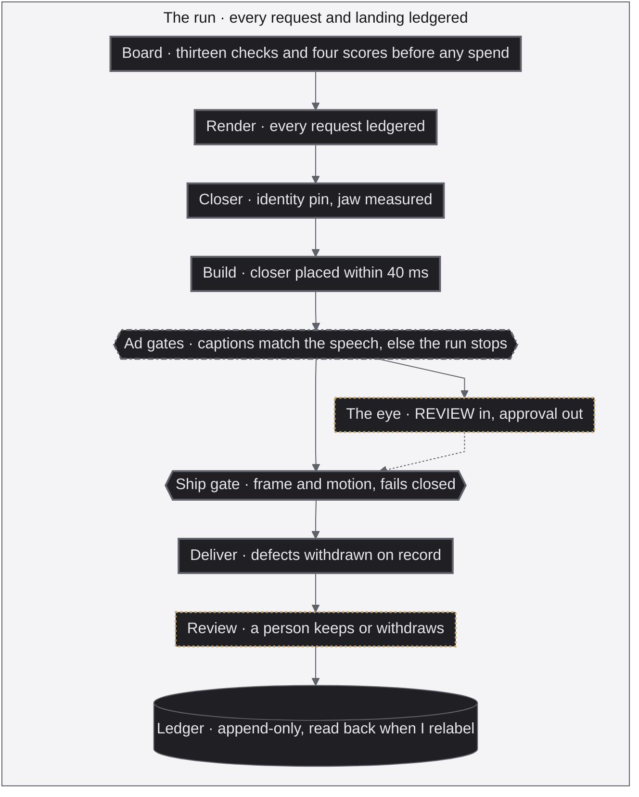

<p align="center">
  
</p>

<div align="center">

<b><font size="6">Autonomous Ads, Multimodal Router, Three-Tier Evals</font></b>

<br/>

<a href="https://github.com/jameswniu/autonomous-ads-pipeline-multimodal-evals/actions/workflows/checks.yml"></a>


<br/><br/>

<strong>I let it shoot ads with nobody watching, and it could not spend a dollar until its own checks passed.</strong><br/>
The evals grade pixels and audio instead of text, and they double as the router, picking an engine for each audience the way Perplexity picks a model per question.<br/>
This repository is that pipeline: the graph that runs it, the gates that stop it and the evals behind them.

<br/>

<code>board -> render -> gate -> ship -> ledger</code>

</div>

---

## Run it on the pixels that ship

Two things are checkable here without accounts, keys or a GPU. `python3` and `ffmpeg` are the only prerequisites.

```
python3 -m venv .venv && . .venv/bin/activate
pip install -r requirements.txt

python3 evals/derive.py                    # re-derive the ten named thresholds
python3 probes/mirror_probe.py samples/exemplar-harbor-wan3-live.mp4
python3 probes/mirror_probe.py samples/frozen-control-slowroad.mp4 || echo "exit $?"
```

The derivation prints every named constant beside the labelled pass and labelled reject that bracket it, counts them at `10 of 10 NAMED gating thresholds are DERIVED`, and exits 0. The two probes print one line each, and the second reports its exit:

```
MIRROR FORWARD: 16s | repeat 1.00 at P=5s (reject <0.4) | mirror 0.58 at t=10.4 (reject <0.22)
MIRROR UNJUDGEABLE: scene distance 0.7 < floor 5.0. NOT a pass - too static to measure.
exit 3
```

**The second one exits 3, which is the right answer and not a broken run.** A frozen frame held for 40 s has no scene motion to measure, so the probe refuses to call it a pass. That clip is the labelled reject the derivation brackets `mirror_probe.CONTROL_FLOOR` with, and the live take from the previous command is the labelled pass on the same axis.

**`evals/derive.py` does not score a video.** It re-measures labelled exemplars and brackets the gating constants. The per-video path is a probe, or `gates/ad_gates.sh` for a full master, which needs the scene files and the caption manifest that live beside a master in a shoot directory and are not in this repository.

**How do you craft evals? Split the question in three, and give each part its own source of truth.**

| | The question it answers | Where its truth comes from | When it changes |
|:---|:---|:---|:---|
| **Process evals** | Did every step run, in order, and did its gate fire before money moved? | The pipeline's own graph | Only when the scripts change |
| **Outcome evals** | Is what shipped true, to the brief and to the facts it leans on? | The research pass behind the brief | Every time the brief changes |
| **Quality evals** | Does it meet the bar for the audience it was made for? | A golden set of hand-labelled exemplars, plus the market's own bar | Every time the audience changes |

Three words carry the page. A **probe** is a check, a **threshold** is the line that check has to clear, and a **gate** is what stops the job when the line is not cleared. Every probe here is a measurement on the file itself, pixels, audio and timing. Making the video was the easy half. The hard half is autonomy, deciding with nobody in the room whether it is good enough to pay for.

The proof below comes from one autonomous ad production that ran end to end with nobody driving. Twenty-eight versions across five invented brands, then ten spec ads for real products, every render gated before a dollar moved.

<table>
  <tr>
    <td width="33%" align="center" valign="top"><a href="#1-process-evals"></a><br><b>Process.</b> Fifty-nine scene renders across four rounds sit in the ledger behind the eight cuts that shipped, and every gate fired before a dollar moved. <a href="#1-process-evals">See the ledger</a></td>
    <td width="33%" align="center" valign="top"><a href="#2-outcome-evals"></a><br><b>Outcome.</b> Four hundred pages fold into one. The line this spot closes on is the line on the company's own page, checked by a second engine told to refute it. <a href="#2-outcome-evals">See the spec ads</a></td>
    <td width="33%" align="center" valign="top"><a href="#3-quality-evals"></a><br><b>Quality.</b> Four engines shot the same coffee brief. A panel tuned to morning craving picked this one, and a panel tuned to sleep picked a different engine for a different brand. <a href="#3-quality-evals">See the race</a></td>
  </tr>
</table>

> The presenter is generated. She is not a real person and not a likeness of one, and her voice is a clone of a consented source. Every version of every spot is on this page or in its ledger, and the failures sit next to the winners.

---

## 1. Process evals

Process evals check how the work got made, before anyone looks at the result.

Every spot ends on the closer, a presenter who speaks the brand line to camera, animated from a look, one still photo of her in a set.

- Every step has a contract, the contract is checked the moment the step runs, and a failed check stops the job before the next dollar is spent.
- The exact scripts that ran are in this repository. Boards, batch drivers and ledgers in [`shoots/`](shoots/), the board probe, caption gate and closer checks in [`gates/`](gates/), the pixel probes in [`probes/`](probes/), the guards in [`guards/`](guards/), three before a paid render and one before delivery. The code map near the end says what each file is.


| Step | What it has to prove before the next step may start | How it fails |
|:---|:---|:---|
| Board | Thirteen free checks on the board's text, before a cent is spent, held to the three rules in [`DOCTRINE.md`](pipeline/DOCTRINE.md)<br>• Seven on the idea, such as the hook scene opening the film and no scene naming the product before the payoff<br>• Six that keep the shoot consistent, such as one written character and narration with no he or she in it, four of them optional<br>Then four judgment rows I score 0 to 3 by eye, and a live run spends nothing until all four reach 2 and the board names who scored them | The board goes back |
| Render | Every vendor request and its landing appended to the ledger, the vendor's own rejection text included, with the three voice draws logged as one request | Recorded, each broken scene is re-rolled once, and a second failure stops the run |
| Closer | Identity pin on the voice and avatar ids, prop gate on the look, jaw measured on the raw render and read against the band | The pins and the look fail before the spend, the jaw read after the render |
| Build | The closer's video starts within 40 ms of where its audio was placed | Measured in frames, from the build's own segments |
| Ad gates | Every caption cue matches the transcript of the audio in the cut (text to 0.90, numbers exact), within 0.5 s before or 0.3 s after its first word. The closer's mouth tracks its audio | A failure stops the run, and a mouth that reads REVIEW or lags 0.12 s or more goes to the eye |
| Ship gate | • No letterbox<br>• Light that agrees with the clock and the words, waived and logged for ad fiction in a graph run<br>• One-way motion read by eye, unless the replay probe finds it runs only forward<br>• Mouth-settle and coherence readings disclosed<br>• Exit 64 on unreadable input | Fails closed |
| Deliver | A defective delivered cut is withdrawn, replaced, and the withdrawal ledgered with its reason | On the record |

### The redo, as a ledger reads it

Four invented-brand spots were shot again after I kept rejecting boards. I review every cut by eye, and I am the only human in the loop.

- Each spot shipped two ways. One leg ran on the engine I had picked from the four-engine race in section 3, the other on Omni Flash, from the same boards, narrations, closers, beds and captions. The only variable between the columns is the engine. A later rescore overturned my pick for Lantern, Harbor and Slow Road, so those three legs raced Wan 3.0, Wan 3.0 and Seedance 2.0 rather than the panel's winners. The redo's own scores in the ledger are unchanged.
- The [ledgers](shoots/) hold four rounds behind them, 16, 16, 12 and 15 engine requests, 59 in all, two of them music beds, for eight shipped versions.

<table>
  <tr>
    <td width="50%" align="center" valign="top"><br><b>Orchard Hill Coffee, Seedance 2.0, the first-race WINNER.</b> <a href="https://github.com/jameswniu/autonomous-ads-pipeline-multimodal-evals/releases/download/media-2026-08/shoot-20260826-seedance2-orchard.mp4">&#9654; with sound</a></td>
    <td width="50%" align="center" valign="top"><br><b>Orchard Hill Coffee, Omni Flash.</b> <a href="https://github.com/jameswniu/autonomous-ads-pipeline-multimodal-evals/releases/download/media-2026-08/shoot-20260826-omni-orchard.mp4">&#9654; with sound</a></td>
  </tr>
</table>

| Process record, Orchard Hill Coffee | Seedance 2.0 | Omni Flash |
|:---|:---|:---|
| Scene renders in the ledger across the rounds, re-rolls included | 11 | 3 |
| Caption gate on the shipped master | PASS, 5 cues | PASS, 5 cues |
| Closer video against its audio placement | 0 ms | 0 ms |
| Mouth sync on the shared closer | PASS, +0.08 s | PASS, +0.08 s |
| Master that shipped | v3 | v1 |

<table>
  <tr>
    <td width="50%" align="center" valign="top"><br><b>Lantern Street, Wan 3.0.</b> <a href="https://github.com/jameswniu/autonomous-ads-pipeline-multimodal-evals/releases/download/media-2026-08/shoot-20260826-wan3-lantern.mp4">&#9654; with sound</a></td>
    <td width="50%" align="center" valign="top"><br><b>Lantern Street, Omni Flash.</b> <a href="https://github.com/jameswniu/autonomous-ads-pipeline-multimodal-evals/releases/download/media-2026-08/shoot-20260826-omni-lantern.mp4">&#9654; with sound</a></td>
  </tr>
</table>

<table>
  <tr>
    <td width="50%" align="center" valign="top"><br><b>Harbor Lane Realty, Wan 3.0.</b> <a href="https://github.com/jameswniu/autonomous-ads-pipeline-multimodal-evals/releases/download/media-2026-08/shoot-20260826-wan3-harbor.mp4">&#9654; with sound</a></td>
    <td width="50%" align="center" valign="top"><br><b>Harbor Lane Realty, Omni Flash, the first-race WINNER.</b> <a href="https://github.com/jameswniu/autonomous-ads-pipeline-multimodal-evals/releases/download/media-2026-08/shoot-20260826-omni-harbor.mp4">&#9654; with sound</a></td>
  </tr>
</table>

<table>
  <tr>
    <td width="50%" align="center" valign="top"><br><b>Slow Road Travel, Seedance 2.0.</b> <a href="https://github.com/jameswniu/autonomous-ads-pipeline-multimodal-evals/releases/download/media-2026-08/shoot-20260826-seedance2-slowroad.mp4">&#9654; with sound</a></td>
    <td width="50%" align="center" valign="top"><br><b>Slow Road Travel, Omni Flash.</b> <a href="https://github.com/jameswniu/autonomous-ads-pipeline-multimodal-evals/releases/download/media-2026-08/shoot-20260826-omni-slowroad.mp4">&#9654; with sound</a></td>
  </tr>
</table>

| The other three spots | Renders in the ledger, winner's engine and Omni | Mouth sync on the shared closer | Masters that shipped |
|:---|:---|:---|:---|
| Lantern Street, Wan 3.0 | 8 and 3 | REVIEW, 0.00 s, eye approved | v7 and v1 |
| Harbor Lane Realty, Wan 3.0 | 12 and 5, the sign scene re-rolled for an invented phone number | PASS, 0.00 s | v5 and v2 |
| Slow Road Travel, Seedance 2.0 | 11 and 4 | REVIEW, +0.04 s, eye approved | v4 and v1 |

Every one of the eight masters passed the caption gate at five cues and held its closer at 0 ms drift. REVIEW means the mouth probe could not read the closer well enough to rule and handed the call to me, and the ledger says so. All eight cuts are in the [media release](https://github.com/jameswniu/autonomous-ads-pipeline-multimodal-evals/releases/tag/media-2026-08), with sound.

The guards, and the 15 governed runs that showed which prompt-level rules held, are covered in [docs/ENFORCEMENT.md](docs/ENFORCEMENT.md).

---

## 2. Outcome evals

Outcome evals check the artifact against the facts and do not care how it got made.

- The claim on screen is compared with the source it was pulled from. How confident the model sounded does not count.
- The facts came from a pairwise research pass, one engine scanning the company's live pages and the other told to refute what it found.

For an ad, true means three things.

- The claim a spot closes on is the claim the company actually makes, in its own current words.
- The words on screen are the words being spoken, and the words being spoken are the script. The caption gate checks the first half, against a transcription of the audio in the cut. A transcription diffed against the script before any render is paid for checks the second.
- A prop that carries the story reads in the delivered crop.

### Ten real products

The same loop ran against ten real, currently shipping AI products.

- All ten shot on Omni Flash at about sixty cents a scene, thirty scenes across two batches.
- These are spec ads. They are not affiliated with, endorsed by, or produced for Google, OpenAI, Perplexity, Meta, xAI, Z.ai, Moonshot AI or Anthropic. None of these companies has seen them, and every tagline is written here.

<table>
  <tr>
    <td width="50%" align="center" valign="top"><br><b>Claude.</b> Forty versions of you are arguing around the table and every one of them is sure. <a href="https://github.com/jameswniu/autonomous-ads-pipeline-multimodal-evals/releases/download/media-2026-08/shoot-20260830-claude.mp4">&#9654; with sound</a></td>
    <td width="50%" align="center" valign="top"><br><b>Claude Code.</b> His code grew legs overnight and finishes the feature while he sips the coffee. <a href="https://github.com/jameswniu/autonomous-ads-pipeline-multimodal-evals/releases/download/media-2026-08/shoot-20260830-claudecode.mp4">&#9654; with sound</a></td>
  </tr>
</table>

<table>
  <tr>
    <td width="50%" align="center" valign="top"><br><b>Google Pics.</b> The photo is almost right, and almost is the thing that ruins it. <a href="https://github.com/jameswniu/autonomous-ads-pipeline-multimodal-evals/releases/download/media-2026-08/shoot-20260827-pics.mp4">&#9654; with sound</a></td>
    <td width="50%" align="center" valign="top"><br><b>Gemini.</b> Your head has forty tabs open and not one of them is labelled. <a href="https://github.com/jameswniu/autonomous-ads-pipeline-multimodal-evals/releases/download/media-2026-08/shoot-20260827-gemini.mp4">&#9654; with sound</a></td>
  </tr>
</table>

<table>
  <tr>
    <td width="50%" align="center" valign="top"><br><b>Z.ai.</b> Your studio apartment is smaller than the problem you're solving. <a href="https://github.com/jameswniu/autonomous-ads-pipeline-multimodal-evals/releases/download/media-2026-08/shoot-20260927-zai-neurons-av7.mp4">&#9654; with sound</a></td>
    <td width="50%" align="center" valign="top"><br><b>Kimi.</b> She has one question and a library's worth of everything else. <a href="https://github.com/jameswniu/autonomous-ads-pipeline-multimodal-evals/releases/download/media-2026-08/shoot-20260830-kimi.mp4">&#9654; with sound</a></td>
  </tr>
</table>

<table>
  <tr>
    <td width="50%" align="center" valign="top"><br><b>ChatGPT.</b> It is never the big decisions that eat the evening. <a href="https://github.com/jameswniu/autonomous-ads-pipeline-multimodal-evals/releases/download/media-2026-08/shoot-20260827-chatgpt.mp4">&#9654; with sound</a></td>
    <td width="50%" align="center" valign="top"><br><b>Perplexity.</b> Four hundred tabs, ten blue links, and still no answer. <a href="https://github.com/jameswniu/autonomous-ads-pipeline-multimodal-evals/releases/download/media-2026-08/shoot-20260927-perplexity-neurons-av7.mp4">&#9654; with sound</a></td>
  </tr>
</table>

<table>
  <tr>
    <td width="50%" align="center" valign="top"><br><b>Meta AI.</b> Some days the list unrolls right out the front door. <a href="https://github.com/jameswniu/autonomous-ads-pipeline-multimodal-evals/releases/download/media-2026-08/shoot-20260827-metaai.mp4">&#9654; with sound</a></td>
    <td width="50%" align="center" valign="top"><br><b>Grok.</b> Your world just changed. Again. Try keeping up. <a href="https://github.com/jameswniu/autonomous-ads-pipeline-multimodal-evals/releases/download/media-2026-08/shoot-20260927-grok-hook-av7.mp4">&#9654; with sound</a></td>
  </tr>
</table>

| Spot | The claim it closes on | Checked against | |
|:---|:---|:---|:---|
| Claude | A thoughtful collaborator for serious work, until the answer is one page | claude.com and anthropic.com | [&#9654;](https://github.com/jameswniu/autonomous-ads-pipeline-multimodal-evals/releases/download/media-2026-08/shoot-20260830-claude.mp4) |
| Claude Code | The agent in your terminal that reads the codebase, fixes the bugs and ships the feature | The product page and its documentation | [&#9654;](https://github.com/jameswniu/autonomous-ads-pipeline-multimodal-evals/releases/download/media-2026-08/shoot-20260830-claudecode.mp4) |
| Google Pics | Image creation and editing that brings your exact vision to life, down to a single object | Google's own I/O announcement | [&#9654;](https://github.com/jameswniu/autonomous-ads-pipeline-multimodal-evals/releases/download/media-2026-08/shoot-20260827-pics.mp4) |
| Gemini | Google's personal assistant, hands free, across the apps you already use | gemini.google.com | [&#9654;](https://github.com/jameswniu/autonomous-ads-pipeline-multimodal-evals/releases/download/media-2026-08/shoot-20260827-gemini.mp4) |
| Z.ai | Frontier open models, the same weights the big labs guard, priced for builders | z.ai and its developer documentation | [&#9654;](https://github.com/jameswniu/autonomous-ads-pipeline-multimodal-evals/releases/download/media-2026-08/shoot-20260927-zai-neurons-av7.mp4) |
| Kimi | A million pages read in a breath, answered with the one line that matters | moonshot.ai and kimi.com | [&#9654;](https://github.com/jameswniu/autonomous-ads-pipeline-multimodal-evals/releases/download/media-2026-08/shoot-20260830-kimi.mp4) |
| ChatGPT | Help with everyday questions and ideas | OpenAI's ChatGPT overview page | [&#9654;](https://github.com/jameswniu/autonomous-ads-pipeline-multimodal-evals/releases/download/media-2026-08/shoot-20260827-chatgpt.mp4) |
| Perplexity | An answer engine that hands back the answer with its sources attached | Perplexity's hub and help centre | [&#9654;](https://github.com/jameswniu/autonomous-ads-pipeline-multimodal-evals/releases/download/media-2026-08/shoot-20260927-perplexity-neurons-av7.mp4) |
| Meta AI | A personal agent that works on your behalf | Meta's own page on personal agents | [&#9654;](https://github.com/jameswniu/autonomous-ads-pipeline-multimodal-evals/releases/download/media-2026-08/shoot-20260827-metaai.mp4) |
| Grok | Real-time answers with the sources still warm, from where news breaks first | x.ai and its developer documentation | [&#9654;](https://github.com/jameswniu/autonomous-ads-pipeline-multimodal-evals/releases/download/media-2026-08/shoot-20260927-grok-hook-av7.mp4) |

---

## 3. Quality evals

- A quality check, in practice, is a person watching a clip and saying good enough or not. Every quality eval here ends with people. 90 raters on Prolific, a paid survey site, cast 450 blind votes between pairs of the ads, and the model judge in [`kill-gate/`](kill-gate/) and the router below are both scored against those votes.
- The labels behind the thresholds and the judge are mine, 48 exemplars and 42 scenes, and the verdicts were compiled into numbers a scheduler can enforce.
- One probe battery serves every audience. A category picks which rows gate and which merely report, and the direction of good is set per audience. A coffee ad reads gesture energy upward and a sleep ad flips the same instrument, because calm sells.
- I stay the final judge. A language-model judge attaches a blind description and a flag to the strip as evidence and never holds the verdict.

### The router, and the race behind it

Four engines ran the same five briefs, and the panels picked a different winner per audience. The winners table below is the router. A brief comes in, the panel for that audience scores the pool, and the highest row wins the buy.

- Bold is the best reading in its row, in that row's own direction.
- The WINNER takes the most rows. When versions tie, the row the panel gates on decides.

<table>
  <tr>
    <td width="25%" align="center" valign="top"><br><b>A0 &middot; HeyGen, the baseline.</b> <a href="https://github.com/jameswniu/autonomous-ads-pipeline-multimodal-evals/releases/download/media-2026-08/shoot-20260824-a0-orchard.mp4">&#9654; with sound</a></td>
    <td width="25%" align="center" valign="top"><br><b>B1 &middot; Omni Flash.</b> <a href="https://github.com/jameswniu/autonomous-ads-pipeline-multimodal-evals/releases/download/media-2026-08/shoot-20260824-omni-orchard.mp4">&#9654; with sound</a></td>
    <td width="25%" align="center" valign="top"><br><b>B2 &middot; Wan 3.0.</b> <a href="https://github.com/jameswniu/autonomous-ads-pipeline-multimodal-evals/releases/download/media-2026-08/shoot-20260824-wan3-orchard.mp4">&#9654; with sound</a></td>
    <td width="25%" align="center" valign="top"><div><a name="winner-orchard"></a></div><br><b>B3 &middot; Seedance 2.0, the WINNER.</b> <a href="https://github.com/jameswniu/autonomous-ads-pipeline-multimodal-evals/releases/download/media-2026-08/shoot-20260824-seedance2-orchard.mp4">&#9654; with sound</a></td>
  </tr>
</table>

Orchard Hill Coffee sells morning energy and craving, so its panel gates gesture upward and lets the busy kitchen report.

| Probe | A0 HeyGen | B1 Omni Flash | B2 Wan 3.0 | **B3 Seedance 2.0, the WINNER** |
|---|---|---|---|---|
| Gesture energy, higher is better, gates | 0.468 | 0.609 | **0.787** | 0.664 |
| Background clutter, lower is better, bar 5.5 | 4.89 | **3.52** | 5.15 | 6.57 |
| Eye rejection, lower is better, reports | 9.86 | 8.68 | 12.79 | **7.69** |
| Scene simplicity, lower is calmer, reports | 7.37 | **6.7** | 8.10 | **6.7** |
| Face level wander, lower is steadier, reports | 148.9 | 150.6 | 150.3 | **114.5** |

Re-run against the released Seedance master, face level 114.5, eye rejection 7.69 and background clutter 6.57 came back exactly, gesture 0.667 and scene 6.78 within probe scatter. Any row reproduces with `python3 probes/<probe>.py <master.mp4>`, and the redo's probe outputs ship in [`shoots/ads6-omni/probe-outputs/`](shoots/ads6-omni/probe-outputs/). The table is the first reading. A later rescore in the ledger measured the released masters again, so nine of these twenty cells differ slightly and no row's best reading changes.

The same four engines shot Quiet Hours, a brief that sells permission to rest, and here the premium baseline swept the calm rows.

<table>
  <tr>
    <td width="25%" align="center" valign="top"><div><a name="winner-quiet"></a></div><br><b>A0 &middot; HeyGen, the WINNER.</b> <a href="https://github.com/jameswniu/autonomous-ads-pipeline-multimodal-evals/releases/download/media-2026-08/shoot-20260824-a0-quiet.mp4">&#9654; with sound</a></td>
    <td width="25%" align="center" valign="top"><br><b>B1 &middot; Omni Flash.</b> <a href="https://github.com/jameswniu/autonomous-ads-pipeline-multimodal-evals/releases/download/media-2026-08/shoot-20260824-omni-quiet.mp4">&#9654; with sound</a></td>
    <td width="25%" align="center" valign="top"><br><b>B2 &middot; Wan 3.0.</b> <a href="https://github.com/jameswniu/autonomous-ads-pipeline-multimodal-evals/releases/download/media-2026-08/shoot-20260824-wan3-quiet.mp4">&#9654; with sound</a></td>
    <td width="25%" align="center" valign="top"><br><b>B3 &middot; Seedance 2.0.</b> <a href="https://github.com/jameswniu/autonomous-ads-pipeline-multimodal-evals/releases/download/media-2026-08/shoot-20260824-seedance2-quiet.mp4">&#9654; with sound</a></td>
  </tr>
</table>

| Spot | The feeling it sells, and the row that gates | Eye at the time | WINNER | Why the panel says so |
|:---|:---|:---|:---|:---|
| Orchard Hill Coffee | Morning craving, gesture energy upward | Seedance 2.0 | [Seedance 2.0](#winner-orchard) | Three rows: cleanest eye read, steadiest face, tie for calmest scene |
| Lantern Street | Three a.m. relief, clutter down | Wan 3.0 | [HeyGen](#winner-lantern) | Two rows, the calmest background and the calmest scene, against one row each for the other three |
| Harbor Lane Realty | Neighborhood warmth, gesture upward | Wan 3.0 | [Omni Flash](#winner-harbor) | Two rows, the cleanest eye read and the calmest scene, against one row each for the other three |
| Quiet Hours | Permission to rest, gesture flipped so calm wins | HeyGen | [HeyGen](#winner-quiet) | Sweeps the four calm rows, though people's votes put it last of the four |
| Slow Road Travel | Wanderlust, gesture upward | Seedance 2.0 | [Wan 3.0](#winner-slowroad) | Two rows each with Seedance, so the gated row decides it, gesture 0.919 against 0.721 |

The first-race clips of the other three winners.

<table>
  <tr>
    <td width="33%" align="center" valign="top"><div><a name="winner-lantern"></a></div><br><b>Lantern Street, A0 &middot; HeyGen, the WINNER.</b> <a href="https://github.com/jameswniu/autonomous-ads-pipeline-multimodal-evals/releases/download/media-2026-08/shoot-20260824-a0-lantern.mp4">&#9654; with sound</a></td>
    <td width="33%" align="center" valign="top"><div><a name="winner-harbor"></a></div><br><b>Harbor Lane Realty, B1 &middot; Omni Flash, the WINNER.</b> <a href="https://github.com/jameswniu/autonomous-ads-pipeline-multimodal-evals/releases/download/media-2026-08/shoot-20260824-omni-harbor.mp4">&#9654; with sound</a></td>
    <td width="33%" align="center" valign="top"><div><a name="winner-slowroad"></a></div><br><b>Slow Road Travel, B2 &middot; Wan 3.0, the WINNER.</b> <a href="https://github.com/jameswniu/autonomous-ads-pipeline-multimodal-evals/releases/download/media-2026-08/shoot-20260824-wan3-slowroad.mp4">&#9654; with sound</a></td>
  </tr>
</table>

All five races were scored from the released masters, and every probe value now sits on the ledger under the `ads2-rescore` cohort. The panel agreed with the eye on Orchard and Quiet and overturned it on Lantern, Harbor and Slow Road. Both calls are kept, the hand call still as `recorded_winner` and now with `agrees` false, beside the numbers that overturned it. The WINNER column is the panel's answer, because the panel is the router. The ledger is `races/races.jsonl`, `tools/score_race.py` recomputes each winner from it, and `tests/test_races.py` runs that check.

No engine sweeps the catalogue. On the 398 blind Prolific votes for these four-engine ads people preferred Wan 3.0 on Orchard, Omni Flash on Harbor and Seedance 2.0 on the other three briefs, so the panel's pick matched theirs on Harbor only. Its picks, made with all four ads already scored, win 52% of their head-to-head votes on average, where a coin wins 50% and always choosing Seedance 2.0 wins 59%, so the panel has not earned the router's job yet. `kill-gate/eval/facts.py` prints each of these figures.

- Scored again after the redo, with the engine I had picked for each brief meeting Omni Flash, the answer became Orchard to Omni Flash, Lantern to Wan 3.0, Harbor to Omni Flash and Slow Road to Seedance 2.0. It is a two-engine rematch, so it does not replace the winners table, and Omni pays its way where a clean frame beats the biggest gesture.
- All twenty versions are in the [media release](https://github.com/jameswniu/autonomous-ads-pipeline-multimodal-evals/releases/tag/media-2026-08).

| Version | Engine | What the Scenes Cost |
|---|---|---|
| A0 | HeyGen video agent, the baseline | 116 vendor credits for its sixteen scenes and seven closers, read off the balance |
| B1 | Omni Flash | About sixty cents a scene, nine dollars for its fifteen |
| B2 and B3 | Wan 3.0 and Seedance 2.0 | About thirty-two dollars together for their thirty scenes, roughly a dollar a scene |

Ten models died in one day, and the record is in [docs/EVALS.md](docs/EVALS.md). The language-model judge is scored against the 42 eye-labelled scenes in [evals/judge-rubric.json](evals/judge-rubric.json).

---

## Nobody directed the shoot

I set the rules and let it run itself. I wrote no scripts for this shoot and supplied five things.

- the architecture and the framework
- the four-phase ad grammar, as a shape to follow
- a realism guard paragraph
- the rule that the most arresting beat opens the film
- the rule that every human on screen is the same presenter

- The agents ran the rest autonomously, loop-engineering boards, prompts, engine calls, quality gates, re-rolls, remasters and delivery, with every request and landing in an append-only ledger.
- The loop itself is the industry's own, hypothesis, variations, tests, winners, run by a multi-agent system instead of a team.
- Most of the evals were designed and calibrated before a single render was paid for, and the rest were added when a shipped defect showed a gap.

## The loop, as a map

One loop, seven steps, and it ran unattended. The gates are where the system stops itself, and that is the only reason it was allowed to spend.

<p align="center">
  
</p>

The figure is generated by `tools/render_map.py` from a declared step list. CI fails if the committed file drifts from the generator, or if the seven step names stop matching the process table above.

The same loop as a graph, and `pipeline/graph.py` is the LangGraph that runs it.

- `python -m pipeline.run --board shoots/graph-zai-shots/boards.json --spot zai --mode dry` walks it with no keys, after `pip install -r requirements.txt`. It runs the board gate for real, writes the scene requests a live run would send with their cost, and stops before the first spend.
- CI runs the same dry run on every push and diffs its ledger against a pinned one.
- A live run needs vendor keys and the pinned presenter identity, which are not in this repo.
- A scene that fails its cast or continuity check is re-rolled once. Past that, a failed gate stops the run until a person resumes it, since rebuilding the same inputs would repeat the fault.
- A crowd of one man can fail the cast check on the small, soft copies at the back while his own face matches. A person who looks can pass that one take by eye, named by its hash on a line of its own, and the refused reading stays on the ledger beside who passed it and why. A main face that misses, a scene with no face, one that reads as the narrator, or a take two lines name is never passed this way. A line not written as a waiver passes nothing, and a failed crowd it may have been meant for waits for a person rather than be shot again.
- A person steps in twice. The eye takes a REVIEW off the ad gates and approves the cut or sends it back to the scene, the closer or the build. After delivery, the review can withdraw the cut and send the run back.
- Who owns a gate is in the stroke, and the table under the graph reads it.



```mermaid
%%{init: {'flowchart': {'curve': 'linear', 'nodeSpacing': 20, 'rankSpacing': 16, 'padding': 6, 'diagramPadding': 2, 'wrappingWidth': 520, 'subGraphTitleMargin': {'top': 6, 'bottom': 10}}, 'themeVariables': {'fontSize': '16px', 'lineColor': '#5f626a', 'edgeLabelBackground': '#ffffff', 'clusterBkg': '#f4f4f7', 'clusterBorder': '#5f626a', 'titleColor': '#18181c'}}}%%
flowchart TD
    subgraph RUN["The run · every request and landing ledgered"]
        direction TB
        AG{{"Ad gates · captions match the speech, else the run stops"}}
        %% GH is an invisible twin of the eye, it balances the spine so the steps stay in one column
        AG ~~~ GH["The eye · REVIEW in, approval out"]
        GH ~~~ SG
        B["Board · thirteen checks and four scores before any spend"] --> R["Render · every request ledgered"] --> C["Closer · identity pin, jaw measured"] --> BU["Build · closer placed within 40 ms"] --> AG --> SG{{"Ship gate · frame and motion, fails closed"}} --> D["Deliver · defects withdrawn on record"]
        D --> RV["Review · a person keeps or withdraws"]
        RV --> L[("Ledger · append-only, read back when I relabel")]
        AG --> EYE["The eye · REVIEW in, approval out"]
        EYE -.-> SG
    end

    classDef run fill:#202024,stroke:#5f626a,color:#e6e6ec
    classDef process fill:#202024,stroke:#5f626a,stroke-width:2px,color:#e6e6ec
    classDef outcome fill:#202024,stroke:#5f626a,stroke-width:2px,stroke-dasharray:6 3,color:#e6e6ec
    classDef quality fill:#202024,stroke:#c9a86a,stroke-width:2px,stroke-dasharray:2 3,color:#e6e6ec
    classDef shared fill:#202024,stroke:#5f626a,stroke-width:2px,stroke-dasharray:6 3 2 3,color:#e6e6ec
    classDef ghost fill:none,stroke:none,color:transparent
    class L run
    class B,R,C,BU,SG,D process
    class AG outcome
    class AG quality
    class AG shared
    class EYE,RV quality
    class GH ghost
    style RUN fill:#f4f4f7,stroke:#5f626a,color:#18181c
```

| Stroke | Tier | Owns |
|---|---|---|
| Solid | 1 Process | Board, Render, Closer, Build, Ship gate, Deliver |
| Dashed | 2 Outcome | Ad gates, shared with quality |
| Dotted | 3 Quality | The probes inside Ad gates, the eye and the review |
| Dash-dot | Shared | Ad gates, outcome and quality together |

## Code map

Vendor ids and Slack fields are replaced with `<id>` or dropped, and home directories sit behind `$SHOOT_ROOT`, `$RENDERS`, `$GATES` and `$PORTRAIT`.

- [`shoots/`](shoots/) holds every batch, with its boards and ledgers.
  - [`ads2-redo/`](shoots/ads2-redo/) is the race, and [`ads3/`](shoots/ads3/) to [`ads5/`](shoots/ads5/) are the redo rounds.
  - [`ads6-omni/`](shoots/ads6-omni/) is the Omni Flash leg, and [`ads7-real/`](shoots/ads7-real/) and [`ads8-real/`](shoots/ads8-real/) are the ten spec ads.
  - Each batch has `boards.json`, a `build-*.sh` driver, `requests.jsonl` and `landings.jsonl`.
  - [`build-ad.sh`](shoots/build-ad.sh) assembles a spot, [`master.sh`](shoots/master.sh) sets its loudness, and [`switches.sh`](shoots/switches.sh) and [`switch_times.py`](shoots/switch_times.py) place the switching sound.
  - The `graph-zai-*` boards feed the graph's tests and the CI dry run, and [`graph-grok-hook/`](shoots/graph-grok-hook/) is one recorded graph run.
- [`gates/`](gates/) holds what a run must pass, in this order. The look's framing checks live in look generation, outside this repo.
  1. [`board_probe.py`](gates/board_probe.py) checks the board, free, before any spend.
  2. On each shot, [`cast_gate.py`](gates/cast_gate.py) checks the person is the story's character, [`continuity_gate.py`](gates/continuity_gate.py) that props and background hold from first frame to last, and [`edge_clip_probe.py`](gates/edge_clip_probe.py) what the frame cuts off.
  3. On the narration, [`voice_take.sh`](gates/voice_take.sh) draws takes, [`voice_probe.py`](gates/voice_probe.py) drops one that drifts, and [`script_match.sh`](gates/script_match.sh) checks the words, using [`textnorm.py`](gates/textnorm.py).
  4. On the closer, [`source_gate.py`](gates/source_gate.py) measures the jaw, and [`jaw_gate.py`](gates/jaw_gate.py) refuses it past 0.17.
  5. On the master, [`ad_gates.sh`](gates/ad_gates.sh) runs [`caption_gate.py`](gates/caption_gate.py) and [`mouth_sync_probe.py`](gates/mouth_sync_probe.py) and checks the closer's placement, [`frontload_gate.py`](gates/frontload_gate.py) flags a slow open, and [`loudness_gate.py`](gates/loudness_gate.py) checks loudness and true peak.
- [`probes/`](probes/) holds the eleven instruments the panels and gates read.
  - Gesture energy, background detail, eye rejection, scene simplicity and face level wander.
  - Lip sync, sync lag, replay detection, and the rest and spasm meters the ship gate runs.
  - [`graph_verdict.py`](probes/graph_verdict.py), which only reports.
- [`guards/`](guards/) holds four guards, three that run before a paid render and the ship gate before delivery.
  - [`arrow_probe.py`](guards/arrow_probe.py) measures her apparent scale over time for the prop gate's arrow scan.
  - The learned rules are what the prop gate reads back.
- [`pipeline/`](pipeline/) is the loop as code, and [`DOCTRINE.md`](pipeline/DOCTRINE.md) states the ad rules it holds every board to.
  - [`graph.py`](pipeline/graph.py) is the LangGraph, [`steps.py`](pipeline/steps.py) holds its seven steps, and [`run.py`](pipeline/run.py) runs a board through it, with no keys in dry mode.
  - [`live.py`](pipeline/live.py) is the part that spends, and [`toolkit.py`](pipeline/toolkit.py) is what the nodes act through.
  - [`ledger.py`](pipeline/ledger.py) writes the run ledger, [`SCHEMA.md`](pipeline/SCHEMA.md) is its format, and [`expected/`](pipeline/expected/) pins the dry run's ledger for CI.
  - [`replay.py`](pipeline/replay.py) checks the older shoots' ledgers against the graph's edges.
- [`evals/`](evals/) holds the labels the thresholds come from.
  - [`labels.csv`](evals/labels.csv) holds the labelled exemplars, and [`derive.py`](evals/derive.py) brackets the thresholds on its list from them without scoring any video.
  - [`judge-rubric.json`](evals/judge-rubric.json) and [`judge-calibration.json`](evals/judge-calibration.json) are the language-model judge's rubric and the 42 eye-labelled scenes it was calibrated on.
- [`races/`](races/), [`tools/`](tools/) and [`tests/`](tests/) hold the race ledger and its panels, the scorer and the other tools CI runs, and the tests that check them.
- [`kill-gate/`](kill-gate/) is a separate experiment on the ad renders.
  - It asks whether a model judge can stand in for people choosing between versions of an ad, and whether it can safely drop the weakest render.
  - It is scored against 450 blind human votes, and its own page has the findings.

## Recounted on every push

- 10 of the 10 named gating thresholds on the tool's list in [`probes/`](probes/) are bracketed by a labelled pass and a labelled reject.
- [`evals/derive.py`](evals/derive.py) re-measures the shipped pixels and refuses to exit clean if a constant has drifted outside its own bracket.
- Its report is checked in CI, so a hand-typed count cannot go stale on this page:

```
10 of 10 NAMED gating thresholds are DERIVED from a labelled pass/reject pair on the same axis
0 are AUTHORED: typed by hand, no exemplar pair in evals/labels
```

**Ten of ten.** The tool counts only the ten constants on its list. Two probes still refuse clips on numbers outside that count, nine in `lipsync_probe`, which have names now but are not on the list yet, and one inline number in `spasm_probe`, and the page says so rather than rounding them away. The commands to check it are at the top of the page.

## Which checks stop a ship, and which only speak

A mixed read is the design, not a broken run. Most probes report and do not refuse.

| Check | On a bad reading |
|:---|:---|
| `caption_gate.py` | **Blocks.** A caption cue whose text does not match the transcript, or that drifts outside its window, fails the master |
| Closer assembly drift | **Blocks** past 40 ms between where the closer's video starts and where its audio was placed |
| `mouth_sync_probe.py` | **Blocks** at FAIL, which is correlation under 0.10, the mouth unrelated to the audio, and when no face is found. REVIEW passes with a logged line and the eye decides |
| `sync_probe.py` | **Speaks only.** Demoted after controls with a known 0.4 s shift moved it 80 ms in the wrong direction |
| `source_gate.py` | **Speaks only.** Prints jaw travel, settle ratio and loop jump as three raw numbers with no verdict, so the metric and the line can be argued separately |
| `probes/` | **Speak only** to the panels and the gates that read them |

A probe says which of those it means in its exit code. `mirror_probe.py` exits 0 when it looked and found no replay, 1 when it found one, 3 when the clip is too static to be judged either way, and 64 when it cannot run at all, no clip named or the file unreadable.

## Why measurement rather than a learned model

Every threshold here is a hand-picked number over a measured signal, and none of them was fitted. Some of the signals come from pretrained models I borrowed, a face detector, a matting model and a vision judge. That was a choice about iteration speed, not a claim that it is the better answer.

- **Taste moved weekly while this was being built.** A constant sitting between a labelled pass and a labelled reject can be moved in an afternoon and re-bracketed by `derive.py` in one command. A fitted model needs relabelling and a retrain to answer the same question.
- **The generative side does hold models.** They are vendor APIs called over the network, not weights in this repository.

## Where the claims stop

- The golden set is one labeller's judgement, mine. `evals/derive.py` checks on every push that each of the ten thresholds sits between its passes and its rejects. A second labeller needs the source renders, and 41 of the 48 labelled rows ship without theirs.
- Only what ships here is claimed, the 48 labelled rows behind the thresholds and the 42 scenes behind the judge.
- Sample sizes are counts, never rates: 15 governed runs, 42 calibration scenes, 8 lip-sync labels.
- Every outcome number here is measured on the creative. Hook rate, hold rate and view-through are the buy's numbers and are not on this page.
- Engine prices and product positioning are from when the shoots ran, and are not re-checked.
- The pinned identity is not in this repo. The voice id, avatar group and look ids are environment variables or `<id>` in the ledgers. The scripts read end to end, and rendering again needs an identity and vendor accounts of your own.

This repository holds the autonomous pipeline: the graph, the probes, the gates, the guards, the labelled exemplars and the derivation. Apache-2.0.
